# 智慧校园系统设计文档

## 目录
1. [系统概述](#系统概述)
2. [数据库设计](#数据库设计)
3. [系统架构](#系统架构)
4. [功能模块](#功能模块)
   - [用户认证模块](#用户认证模块)
   - [成绩管理模块](#成绩管理模块)
   - [课程管理模块](#课程管理模块)
   - [预约管理模块](#预约管理模块)
   - [成绩单生成模块](#成绩单生成模块)
   - [补考管理模块](#补考管理模块)
   - [选课管理模块](#选课管理模块)
   - [教学大纲模块](#教学大纲模块)
   - [课表管理模块](#课表管理模块)
   - [教室管理模块](#教室管理模块)
   - [学费管理模块](#学费管理模块)
   - [奖学金管理模块](#奖学金管理模块)
   - [助学金管理模块](#助学金管理模块)
   - [缴费记录模块](#缴费记录模块)
   - [通知公告模块](#通知公告模块)
   - [错误日志模块](#错误日志模块)
   - [系统报表模块](#系统报表模块)
5. [配置说明](#配置说明)
6. [API文档与测试](#api文档与测试)
7. [部署指南](#部署指南)

## 系统概述

智慧校园系统是一个基于Spring Boot开发的教育管理平台，旨在为学校提供学生管理、教师管理、课程管理、成绩管理、预约服务等综合功能。系统采用前后端分离架构，后端提供RESTful API，前端可以使用任何支持HTTP请求的技术栈实现。

### 技术栈
- 后端框架：Spring Boot 3.5.8
- 数据库：H2（开发）
- ORM：Spring Data JPA
- 安全框架：Spring Security + JWT
- API文档：Swagger/OpenAPI 3
- 工具库：Lombok, Guava, Apache Commons Lang

## 数据库设计

### ER图

```mermaid
erDiagram
    USERS {
        bigint ID PK
        varchar USERNAME UK
        varchar PASSWORD
        varchar REAL_NAME
        varchar EMAIL UK
        varchar PHONE
        varchar USER_TYPE
        varchar STUDENT_ID
        varchar DEPARTMENT
        varchar MAJOR
        integer GRADE
        varchar CLASS_NAME
        varchar TEACHER_ID
        varchar TITLE
        bigint ROLE_ID FK
        integer STATUS
        timestamp CREATE_TIME
        timestamp LAST_LOGIN_TIME
    }

    ROLES {
        bigint ID PK
        varchar NAME UK
        varchar DESCRIPTION
    }

    PERMISSIONS {
        bigint ID PK
        varchar CODE UK
        varchar NAME
        varchar DESCRIPTION
        varchar MODULE
    }

    ROLE_PERMISSIONS {
        bigint ROLE_ID FK
        bigint PERMISSION_ID FK
    }

    GRADES {
        bigint ID PK
        varchar COURSE_CODE
        varchar COURSE_NAME
        timestamp CREATE_TIME
        integer CREDIT
        varchar EXAM_TYPE
        varchar GRADE_LEVEL
        float SCORE
        varchar SEMESTER
        integer STATUS
        timestamp UPDATE_TIME
        bigint STUDENT_ID FK
        bigint TEACHER_ID FK
        float FINAL_SCORE
        float MIDTERM_SCORE
        float REGULAR_SCORE
        varchar REMARK
        float TOTAL_SCORE
        bigint COURSE_ID FK
        float GRADE
        varchar COMMENT
    }

    MAKEUP_EXAMS {
        bigint ID PK
        varchar COURSE_CODE
        varchar COURSE_NAME
        timestamp CREATE_TIME
        timestamp EXAM_DATE
        varchar EXAM_LOCATION
        varchar MAKEUP_GRADE
        varchar ORIGINAL_GRADE
        varchar REASON
        varchar SEMESTER
        varchar STATUS
        timestamp UPDATE_TIME
        bigint STUDENT_ID FK
        bigint TEACHER_ID FK
        varchar APPLY_REASON
        timestamp APPLY_TIME
        varchar APPROVAL_REMARK
        timestamp APPROVAL_TIME
        varchar GRADE_LEVEL
        float SCORE
        bigint ORIGINAL_GRADE_ID FK
    }

    APPOINTMENTS {
        bigint ID PK
        timestamp APPOINTMENT_TIME
        varchar SERVICE_TYPE
        varchar STATUS
        bigint STUDENT_ID FK
    }

    COURSES {
        bigint ID PK
        varchar COURSE_CODE UK
        varchar NAME
        integer CREDIT
        bigint TEACHER_ID FK
        varchar TEACHER_NAME
        bigint CLASSROOM_ID FK
        integer CAPACITY
    }

    CLASSROOMS {
        bigint ID PK
        varchar NAME
        varchar LOCATION
        integer CAPACITY
        varchar EQUIPMENT
    }

    TIMETABLES {
        bigint ID PK
        varchar COURSE_CODE
        varchar COURSE_NAME
        varchar TEACHER_NAME
        varchar CLASSROOM_NAME
        varchar DAY_OF_WEEK
        varchar TIME_SLOT
        varchar SEMESTER
        bigint COURSE_ID FK
        bigint TEACHER_ID FK
        bigint CLASSROOM_ID FK
    }

    SYLLABI {
        bigint ID PK
        varchar COURSE_CODE
        varchar COURSE_NAME
        varchar DESCRIPTION
        varchar OBJECTIVES
        varchar CONTENT
        varchar ASSESSMENT
        varchar TEXTBOOKS
        varchar SEMESTER
        bigint COURSE_ID FK
        bigint TEACHER_ID FK
    }

    COURSE_SELECTIONS {
        bigint ID PK
        bigint STUDENT_ID FK
        bigint COURSE_ID FK
        timestamp SELECTION_TIME
        varchar STATUS
    }

    NOTIFICATIONS {
        bigint ID PK
        varchar TITLE
        varchar CONTENT
        varchar TYPE
        bigint USER_ID FK
        varchar IS_READ
        timestamp CREATE_TIME
    }

    ERROR_LOGS {
        bigint ID PK
        varchar METHOD
        varchar PATH
        varchar PARAMETERS
        varchar ERROR_MESSAGE
        varchar STACK_TRACE
        varchar USER_ID
        timestamp CREATE_TIME
    }

    SYSTEM_REPORTS {
        bigint ID PK
        varchar TITLE
        varchar CONTENT
        varchar TYPE
        varchar STATUS
        bigint CREATED_BY FK
        timestamp CREATE_TIME
        timestamp UPDATE_TIME
    }

    TUITION {
        bigint ID PK
        bigint STUDENT_ID FK
        varchar ACADEMIC_YEAR
        varchar SEMESTER
        decimal AMOUNT
        varchar STATUS
        varchar PAYMENT_METHOD
        timestamp DUE_DATE
        timestamp PAYMENT_DATE
        timestamp CREATE_TIME
        timestamp UPDATE_TIME
    }

    SCHOLARSHIPS {
        bigint ID PK
        varchar NAME
        varchar DESCRIPTION
        decimal AMOUNT
        varchar TYPE
        varchar ACADEMIC_YEAR
        varchar SEMESTER
        bigint STUDENT_ID FK
        varchar STATUS
        timestamp CREATE_TIME
        timestamp UPDATE_TIME
    }

    FINANCIAL_AID {
        bigint ID PK
        bigint STUDENT_ID FK
        varchar TYPE
        decimal AMOUNT
        varchar REASON
        varchar STATUS
        varchar ACADEMIC_YEAR
        varchar SEMESTER
        timestamp CREATE_TIME
        timestamp UPDATE_TIME
    }

    PAYMENT_RECORDS {
        bigint ID PK
        bigint STUDENT_ID FK
        bigint TUITION_ID FK
        decimal AMOUNT
        varchar PAYMENT_METHOD
        varchar TRANSACTION_ID
        varchar STATUS
        timestamp PAYMENT_TIME
        timestamp CREATE_TIME
    }

    USERS ||--o{ GRADES : "学生拥有"
    USERS ||--o{ GRADES : "教师录入"
    USERS ||--o{ MAKEUP_EXAMS : "学生申请"
    USERS ||--o{ MAKEUP_EXAMS : "教师审批"
    USERS ||--o{ APPOINTMENTS : "学生预约"
    USERS ||--o{ COURSES : "教师教授"
    USERS ||--o{ TIMETABLES : "教师安排"
    USERS ||--o{ SYLLABI : "教师编写"
    USERS ||--o{ COURSE_SELECTIONS : "学生选择"
    USERS ||--o{ NOTIFICATIONS : "接收通知"
    USERS ||--o{ SYSTEM_REPORTS : "创建报表"
    USERS ||--o{ TUITION : "缴纳学费"
    USERS ||--o{ SCHOLARSHIPS : "获得奖学金"
    USERS ||--o{ FINANCIAL_AID : "申请助学金"
    USERS ||--o{ PAYMENT_RECORDS : "缴费记录"
    USERS }o--|| ROLES : "拥有角色"
    ROLES }o--o{ PERMISSIONS : "通过ROLE_PERMISSIONS关联"
    COURSES ||--o{ GRADES : "课程成绩"
    COURSES ||--o{ TIMETABLES : "课程时间表"
    COURSES ||--o{ SYLLABI : "课程大纲"
    COURSES ||--o{ COURSE_SELECTIONS : "学生选课"
    COURSES }o--|| CLASSROOMS : "使用教室"
    MAKEUP_EXAMS }o--|| GRADES : "基于原成绩"
    TUITION ||--o{ PAYMENT_RECORDS : "缴费记录"
    SCHOLARSHIPS }o--|| USERS : "获奖学生"
```

### 数据表说明

#### 用户表 (USERS)
存储系统中的所有用户信息，包括学生、教师和管理员。

#### 角色表 (ROLES)
定义系统中的角色，如学生、教师、管理员等。

#### 权限表 (PERMISSIONS)
定义系统中的权限，如查看成绩、录入成绩、管理用户等。

#### 角色权限关联表 (ROLE_PERMISSIONS)
多对多关联表，连接角色和权限。

#### 成绩表 (GRADES)
存储学生的课程成绩信息，包括平时成绩、期中成绩、期末成绩等。

#### 补考表 (MAKEUP_EXAMS)
存储学生的补考申请和成绩信息。

#### 预约表 (APPOINTMENTS)
存储学生的各种预约信息，如咨询、服务预约等。

#### 课程表 (COURSES)
存储课程基本信息。

#### 教室表 (CLASSROOMS)
存储教室信息。

#### 时间表 (TIMETABLES)
存储课程时间安排信息。

#### 教学大纲表 (SYLLABI)
存储课程教学大纲信息。

#### 选课表 (COURSE_SELECTIONS)
存储学生选课信息。

#### 通知表 (NOTIFICATIONS)
存储系统通知和公告信息，支持按用户推送和消息类型分类。

#### 错误日志表 (ERROR_LOGS)
记录系统运行时的错误信息，包括请求方法、路径、参数、错误信息和堆栈跟踪，便于问题排查。

#### 系统报表表 (SYSTEM_REPORTS)
存储系统生成的各类报表数据，包括报表标题、内容、类型和状态。

#### 学费表 (TUITION)
存储学生的学费缴纳信息，包括学费金额、缴费状态、截止日期和缴费方式。

#### 奖学金表 (SCHOLARSHIPS)
存储学生奖学金信息，包括奖学金名称、金额、类型、申请学年学期和发放状态。

#### 助学金表 (FINANCIAL_AID)
存储学生助学金申请信息，包括助学金类型、金额、申请原因和审批状态。

#### 缴费记录表 (PAYMENT_RECORDS)
存储学生的缴费记录，包括缴费金额、支付方式、交易ID和缴费时间。

## 系统架构

### 整体架构图

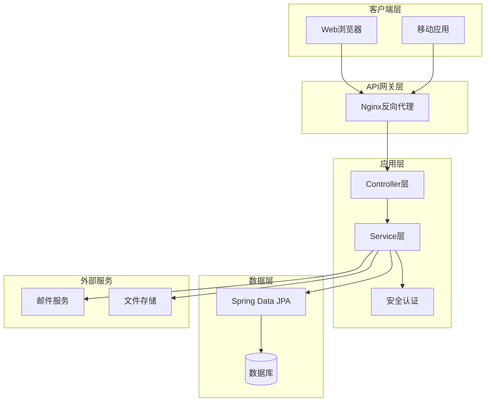

### 分层架构

1. **Controller层**：处理HTTP请求，参数验证，调用Service层处理业务逻辑，返回响应。
2. **Service层**：实现业务逻辑，事务管理，调用Repository层进行数据操作。
3. **Repository层**：数据访问层，使用Spring Data JPA进行数据库操作。
4. **Entity层**：定义数据模型，与数据库表对应。

### 安全架构

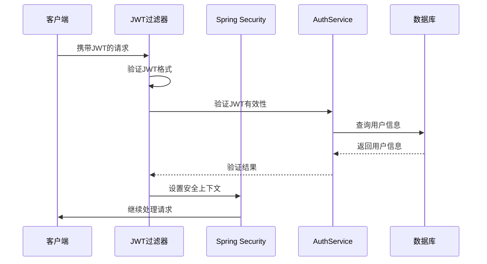

## 功能模块

### 用户认证模块

#### 登录流程图

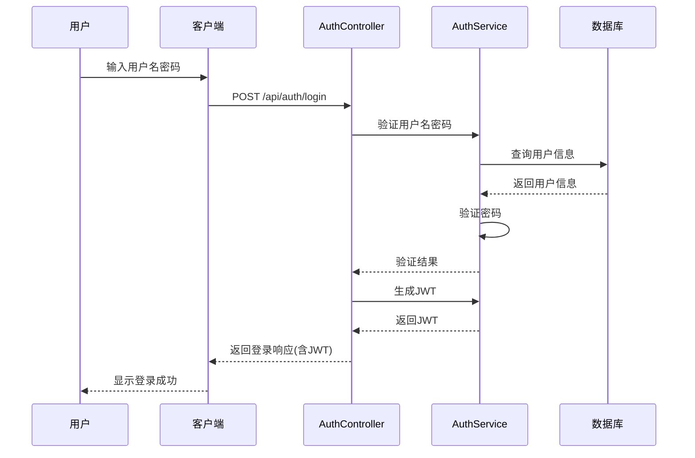

### 成绩管理模块

#### 成绩录入活动图

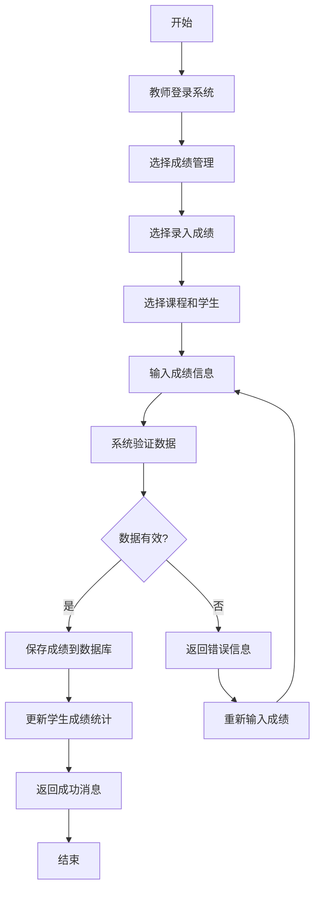

#### 成绩查询状态图

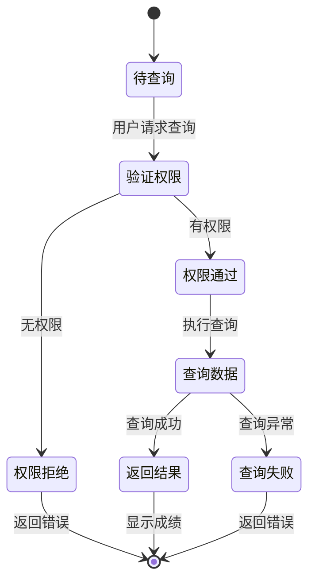

### 课程管理模块

#### 课程创建序列图

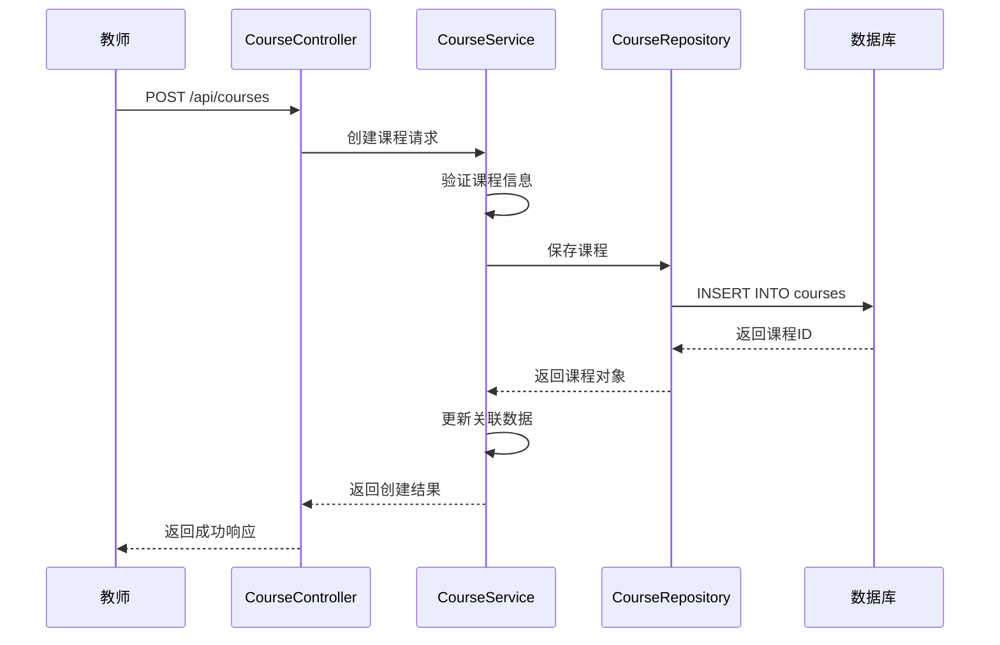

### 预约管理模块

#### 预约流程活动图

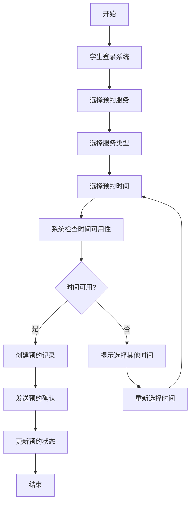

### 成绩单生成模块

#### 成绩单生成序列图

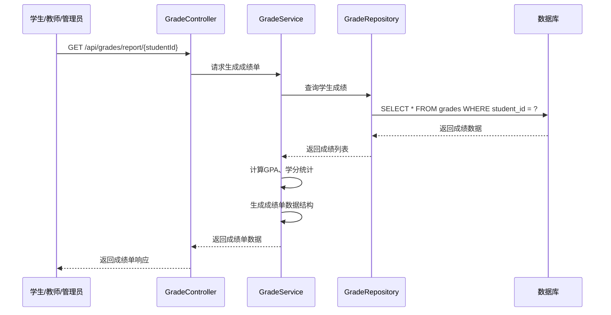

### 补考管理模块

#### 补考申请流程图

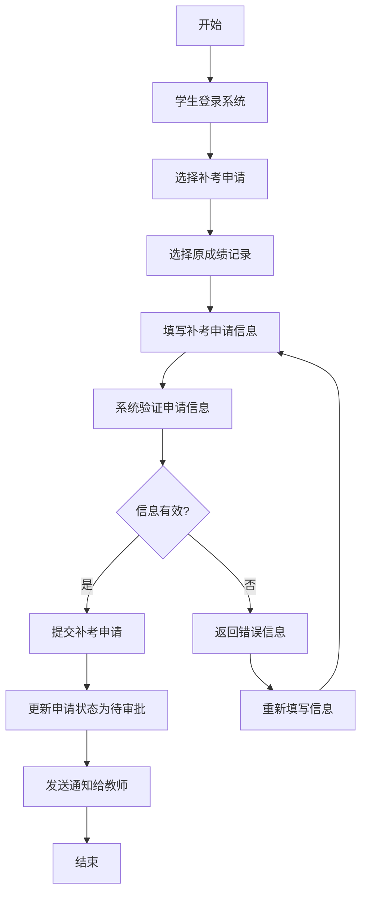

#### 补考审批活动图

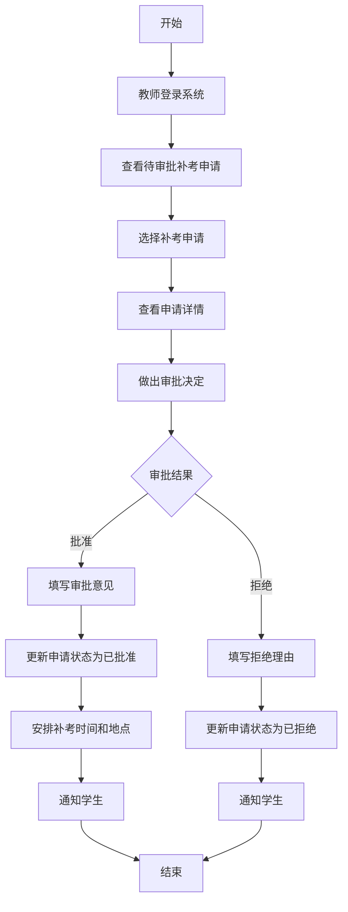

#### 补考成绩录入序列图

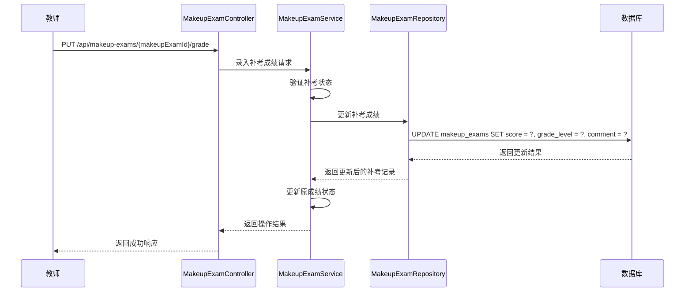

### 选课管理模块

#### 选课流程活动图

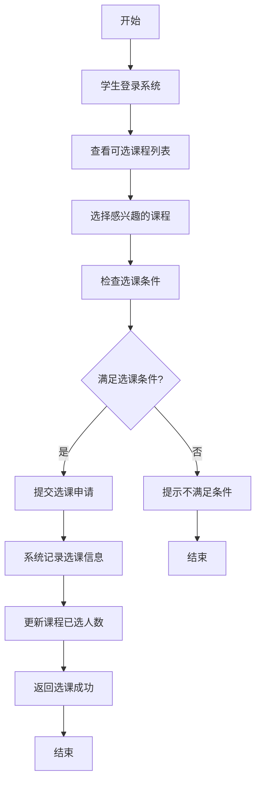

#### 选课查询序列图

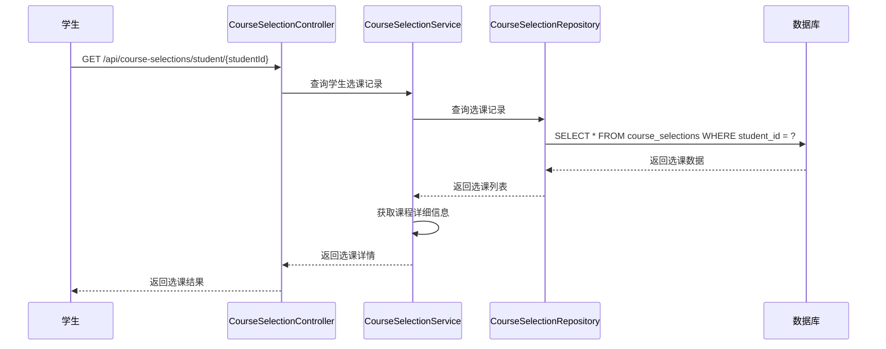

### 教学大纲模块

#### 教学大纲创建序列图

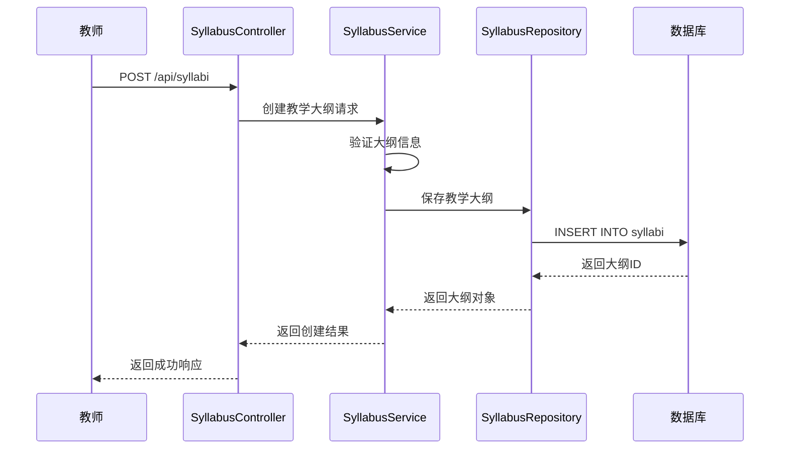

### 课表管理模块

#### 学生课表查询序列图

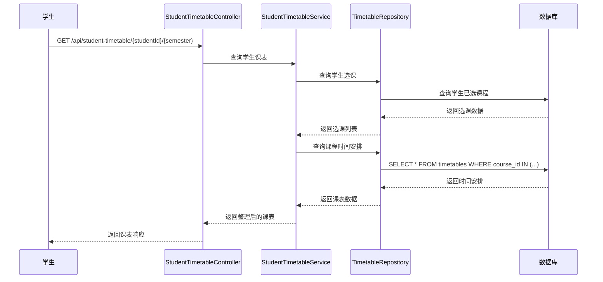

#### 教师课表查询序列图

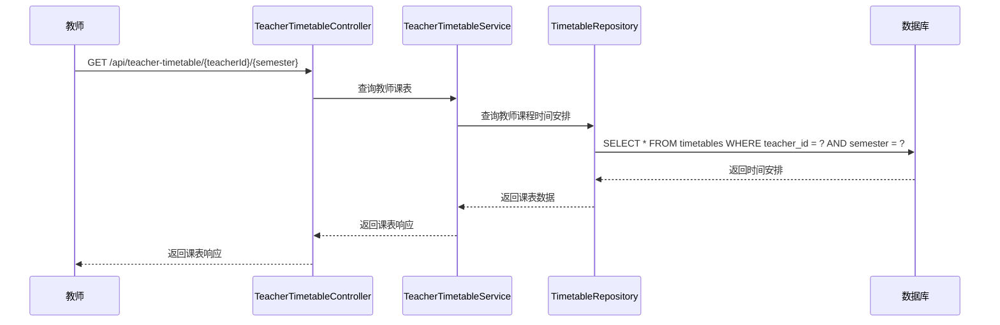

### 教室管理模块

#### 教室管理功能说明

教室管理模块提供教室信息的CRUD操作，包括：
- 教室基本信息管理（名称、位置、容量、设备）
- 教室使用情况查询
- 教室预约管理

### 学费管理模块

#### 学费缴纳流程图

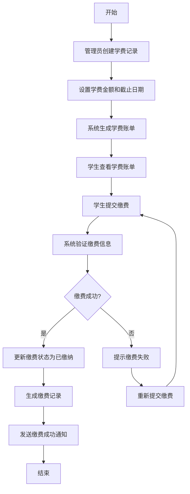

#### 学费查询序列图

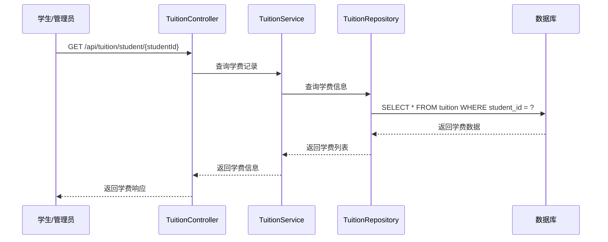

### 奖学金管理模块

#### 奖学金申请流程图

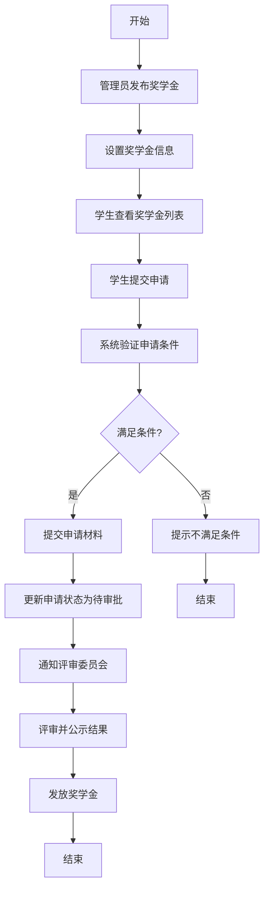

#### 奖学金管理序列图

```mermaid
sequenceDiagram
    participant A as 管理员
    participant C as ScholarshipController
    participant SS as ScholarshipService
    participant R as ScholarshipRepository
    participant DB as 数据库

    A->>C: POST /api/scholarships
    C->>SS: 创建奖学金请求
    SS->>R: 保存奖学金
    R->>DB: INSERT INTO scholarships
    DB-->>R: 返回奖学金ID
    R-->>SS: 返回奖学金对象
    SS-->>C: 返回创建结果
    C-->>A: 返回成功响应

    A->>C: GET /api/scholarships
    C->>SS: 查询奖学金列表
    SS->>R: 查询所有奖学金
    R->>DB: SELECT * FROM scholarships
    DB-->>R: 返回奖学金列表
    R-->>SS: 返回列表
    SS-->>C: 返回奖学金列表
    C-->>A: 返回响应
```

### 助学金管理模块

#### 助学金申请流程图

```mermaid
flowchart TD
    A[开始] --> B[学生查看助学金类型]
    B --> C[选择助学金类型]
    C --> D[填写申请信息]
    D --> E[提交申请材料]
    E --> F[系统验证信息]
    F --> G{验证通过?}
    G -->|是| H[提交申请]
    H --> I[更新状态为待审批]
    I --> J[通知审批人]
    J --> K[审批并公示]
    K --> L[发放助学金]
    L --> M[结束]
    G -->|否| N[提示完善信息]
    N --> O[重新填写]
    O --> D
```

#### 助学金审批序列图

```mermaid
sequenceDiagram
    participant A as 审批人
    participant C as FinancialAidController
    participant FS as FinancialAidService
    participant R as FinancialAidRepository
    participant DB as 数据库

    A->>C: GET /api/financial-aid/pending
    C->>FS: 查询待审批申请
    FS->>R: 查询状态为待审批的申请
    R->>DB: SELECT * FROM financial_aid WHERE status = '待审批'
    DB-->>R: 返回申请列表
    R-->>FS: 返回列表
    FS-->>C: 返回待审批列表
    C-->>A: 返回响应

    A->>C: PUT /api/financial-aid/{id}/approve
    C->>FS: 审批助学金请求
    FS->>R: 更新申请状态
    R->>DB: UPDATE financial_aid SET status = ?, update_time = NOW()
    DB-->>R: 返回更新结果
    R-->>FS: 返回更新后的记录
    FS-->>C: 返回操作结果
    C-->>A: 返回成功响应
```

### 缴费记录模块

#### 缴费记录查询序列图

```mermaid
sequenceDiagram
    participant U as 用户
    participant C as PaymentRecordController
    participant PS as PaymentRecordService
    participant R as PaymentRecordRepository
    participant DB as 数据库

    U->>C: GET /api/payment-records/student/{studentId}
    C->>PS: 查询缴费记录
    PS->>R: 查询学生缴费记录
    R->>DB: SELECT * FROM payment_records WHERE student_id = ?
    DB-->>R: 返回缴费数据
    R-->>PS: 返回缴费列表
    PS-->>C: 返回缴费记录
    C-->>U: 返回响应
```

#### 批量缴费处理序列图

```mermaid
sequenceDiagram
    participant A as 管理员
    participant C as PaymentRecordController
    participant PS as PaymentRecordService
    participant R as PaymentRecordRepository
    participant DB as 数据库

    A->>C: POST /api/payment-records/batch
    C->>PS: 批量创建缴费记录请求
    PS->>PS: 验证请求数据
    PS->>R: 批量保存缴费记录
    R->>DB: 批量INSERT
    DB-->>R: 返回插入结果
    R-->>PS: 返回保存结果
    PS-->>C: 返回处理结果
    C-->>A: 返回成功响应
```

### 通知公告模块

#### 通知发送流程图

```mermaid
flowchart TD
    A[开始] --> B[管理员创建通知]
    B --> C[填写通知内容]
    C --> D[选择通知类型]
    D --> E[选择发送对象]
    E --> F[设置发送时间]
    F --> G[立即发送或定时发送]
    G --> H[系统处理通知]
    H --> I[用户接收通知]
    I --> J[用户查看通知]
    J --> K[更新阅读状态]
    K --> L[结束]
```

#### 通知管理序列图

```mermaid
sequenceDiagram
    participant A as 管理员
    participant C as NotificationController
    participant NS as NotificationService
    participant R as NotificationRepository
    participant DB as 数据库

    A->>C: POST /api/notifications
    C->>NS: 创建通知请求
    NS->>R: 保存通知
    R->>DB: INSERT INTO notifications
    DB-->>R: 返回通知ID
    R-->>NS: 返回通知对象
    NS-->>C: 返回创建结果
    C-->>A: 返回成功响应

    A->>C: GET /api/notifications
    C->>NS: 查询通知列表
    NS->>R: 查询所有通知
    R->>DB: SELECT * FROM notifications ORDER BY create_time DESC
    DB-->>R: 返回通知列表
    R-->>NS: 返回列表
    NS-->>C: 返回通知列表
    C-->>A: 返回响应
```

### 错误日志模块

#### 错误日志记录流程图

```mermaid
flowchart TD
    A[开始] --> B[系统发生错误]
    B --> C[捕获异常信息]
    C --> D[记录错误详情]
    D --> E[记录请求信息]
    E --> F[记录用户信息]
    F --> G[保存到数据库]
    G --> H[可选择发送告警]
    H --> I[结束]
```

#### 错误日志查询序列图

```mermaid
sequenceDiagram
    participant A as 管理员
    participant C as ErrorLogController
    participant ES as ErrorLogService
    participant R as ErrorLogRepository
    participant DB as 数据库

    A->>C: GET /api/error-logs
    C->>ES: 查询错误日志
    ES->>R: 带条件查询日志
    R->>DB: SELECT * FROM error_logs WHERE ...
    DB-->>R: 返回日志数据
    R-->>ES: 返回日志列表
    ES-->>C: 返回错误日志
    C-->>A: 返回响应
```

### 系统报表模块

#### 报表生成流程图

```mermaid
flowchart TD
    A[开始] --> B[管理员选择报表类型]
    B --> C[设置报表参数]
    C --> D[系统收集数据]
    D --> E[数据聚合计算]
    E --> F[生成报表内容]
    F --> G[保存报表记录]
    G --> H[返回报表结果]
    H --> I[结束]
```

#### 系统报表序列图

```mermaid
sequenceDiagram
    participant A as 管理员
    participant C as SystemReportController
    participant SS as SystemReportService
    participant R as SystemReportRepository
    participant DB as 数据库

    A->>C: POST /api/system-reports/generate
    C->>SS: 生成报表请求
    SS->>SS: 根据类型收集数据
    SS->>SS: 计算统计数据
    SS->>R: 保存报表
    R->>DB: INSERT INTO system_reports
    DB-->>R: 返回报表ID
    R-->>SS: 返回报表对象
    SS-->>C: 返回报表数据
    C-->>A: 返回报表响应

    A->>C: GET /api/system-reports/{id}
    C->>SS: 查询报表详情
    SS->>R: 根据ID查询报表
    R->>DB: SELECT * FROM system_reports WHERE id = ?
    DB-->>R: 返回报表数据
    R-->>SS: 返回报表
    SS-->>C: 返回报表详情
    C-->>A: 返回响应
```

## 配置说明

### 端口配置

当前系统使用端口8081，可在`application.yml`中修改：

```yaml
server:
  port: 8081  # 修改为所需端口
```

### 启用Lombok

项目已集成Lombok，确保以下配置：

1. **pom.xml中已添加Lombok依赖**：
```xml
<dependency>
    <groupId>org.projectlombok</groupId>
    <artifactId>lombok</artifactId>
    <optional>true</optional>
</dependency>
```

2. **Maven编译器插件配置**：
```xml
<plugin>
    <groupId>org.apache.maven.plugins</groupId>
    <artifactId>maven-compiler-plugin</artifactId>
    <configuration>
        <source>17</source>
        <target>17</target>
        <annotationProcessorPaths>
            <path>
                <groupId>org.projectlombok</groupId>
                <artifactId>lombok</artifactId>
            </path>
        </annotationProcessorPaths>
    </configuration>
</plugin>
```

3. **IDE配置**：
   - IntelliJ IDEA: 启用"Enable annotation processing"
   - Eclipse: 安装Lombok插件

### 数据库配置

#### H2数据库（开发环境）

```yaml
spring:
  datasource:
    url: jdbc:h2:~/smartcampus
    username: sa
    password:
    driver-class-name: org.h2.Driver
  jpa:
    hibernate:
      ddl-auto: update
    show-sql: true
    properties:
      hibernate:
        format_sql: true
        dialect: org.hibernate.dialect.H2Dialect
  h2:
    console:
      enabled: true
      path: /h2-console
      settings:
        web-allow-others: true
```

#### MySQL数据库（生产环境）

```yaml
spring:
  datasource:
    url: jdbc:mysql://localhost:3306/smartcampus?useUnicode=true&characterEncoding=utf8&useSSL=false&serverTimezone=GMT%2B8
    username: root
    password: your_password
    driver-class-name: com.mysql.cj.jdbc.Driver
  jpa:
    hibernate:
      ddl-auto: update
    show-sql: false
    properties:
      hibernate:
        dialect: org.hibernate.dialect.MySQL8Dialect
```

### JWT配置

JWT相关配置在`JwtUtil`类中：

```java
// JWT有效期
private static final long EXPIRATION_TIME = 86400000; // 24小时

// JWT密钥
private static final String SECRET_KEY = "your-secret-key";
```

生产环境中应将密钥存储在安全的位置，如环境变量或配置中心。

### 日志配置

```yaml
logging:
  level:
    com.example.smartcampus: DEBUG
    org.springframework.security: INFO
    org.springdoc: DEBUG
    org.hibernate.SQL: DEBUG
  pattern:
    console: "%d{yyyy-MM-dd HH:mm:ss} - %msg%n"
    file: "%d{yyyy-MM-dd HH:mm:ss} [%thread] %-5level %logger{36} - %msg%n"
  file:
    name: logs/smart-campus.log
```

## API文档与测试

### Swagger配置

项目已集成Swagger/OpenAPI 3，配置在`SwaggerConfig`类中：

```java
@Configuration
public class SwaggerConfig {
    @Bean
    public OpenAPI customOpenAPI() {
        return new OpenAPI()
                .info(new Info()
                        .title("智慧校园系统API")
                        .version("1.0")
                        .description("智慧校园系统RESTful API文档"))
                .addSecurityItem(new SecurityRequirement().addList("JWT"))
                .components(new Components()
                        .addSecuritySchemes("JWT", new SecurityScheme()
                                .type(SecurityScheme.Type.HTTP)
                                .scheme("bearer")
                                .bearerFormat("JWT")));
    }
}
```

### 访问Swagger UI

启动应用后，可通过以下URL访问API文档：
- Swagger UI: http://localhost:8081/swagger-ui.html
- OpenAPI JSON: http://localhost:8081/v3/api-docs

### API测试步骤

1. **启动应用**：
   ```bash
   mvn spring-boot:run
   ```

2. **访问Swagger UI**：
   打开浏览器，访问 http://localhost:8081/swagger-ui.html

3. **用户认证**：
   - 展开"认证管理"部分
   - 点击"用户登录"接口
   - 点击"Try it out"
   - 输入用户名和密码
   - 执行请求，获取JWT Token

4. **设置认证Token**：
   - 点击页面右上角的"Authorize"按钮
   - 在弹出框中输入JWT Token
   - 点击"Authorize"确认

5. **测试其他API**：
   - 现在可以测试需要认证的API，如成绩管理、课程管理等

### 常用API示例

#### 用户登录
```http
POST /api/auth/login
Content-Type: application/json

{
  "username": "student",
  "password": "password"
}
```

#### 获取成绩列表
```http
GET /api/grades/student/1
Authorization: Bearer <JWT_TOKEN>
```

#### 录入成绩
```http
POST /api/grades/enter
Authorization: Bearer <JWT_TOKEN>
Content-Type: application/json

{
  "courseCode": "CS101",
  "courseName": "计算机科学导论",
  "examType": "期末",
  "score": 85.5,
  "semester": "2023-2024-1",
  "studentId": 1,
  "comment": "表现良好"
}
```

#### 生成成绩单
```http
GET /api/grades/report/{studentId}
Authorization: Bearer <JWT_TOKEN>
```

### 补考管理接口

#### 申请补考
```http
POST /api/makeup-exams/apply
Authorization: Bearer <JWT_TOKEN>
Content-Type: application/json

{
  "originalGradeId": 24,
  "courseCode": "CS101",
  "courseName": "计算机基础",
  "examDate": "2026-02-15T14:00:00",
  "examLocation": "教学楼A101",
  "semester": "2023-2024-1",
  "applyReason": "因病请假未能参加期末考试"
}
```

#### 审批补考申请
```http
PUT /api/makeup-exams/{makeupExamId}/approve
Authorization: Bearer <JWT_TOKEN>
Content-Type: application/json

{
  "status": "已批准",
  "approvalRemark": "已核实情况，同意补考"
}
```

#### 录入补考成绩
```http
PUT /api/makeup-exams/{makeupExamId}/grade
Authorization: Bearer <JWT_TOKEN>
Content-Type: application/json

{
  "score": 78.5,
  "gradeLevel": "中等",
  "comment": "补考成绩合格"
}
```

#### 获取学生补考记录
```http
GET /api/makeup-exams/student/{studentId}
Authorization: Bearer <JWT_TOKEN>
```

#### 获取待审批补考申请
```http
GET /api/makeup-exams/pending
Authorization: Bearer <JWT_TOKEN>
```

## 部署指南

### 本地部署

1. **环境准备**：
   - JDK 17或更高版本
   - Maven 3.6或更高版本

2. **克隆项目**：
   ```bash
   git clone <repository-url>
   cd smart-campus
   ```

3. **构建项目**：
   ```bash
   mvn clean package
   ```

4. **运行应用**：
   ```bash
   java -jar target/smart-campus-0.0.1-SNAPSHOT.jar
   ```

### Docker部署

1. **创建Dockerfile**：
   ```dockerfile
   FROM openjdk:17-jdk-slim
   WORKDIR /app
   COPY target/smart-campus-0.0.1-SNAPSHOT.jar app.jar
   EXPOSE 8081
   ENTRYPOINT ["java", "-jar", "app.jar"]
   ```

2. **构建镜像**：
   ```bash
   docker build -t smart-campus .
   ```

3. **运行容器**：
   ```bash
   docker run -p 8081:8081 smart-campus
   ```