## 3. 用户手册和部署配置

### 3.1 系统概述与快速入门

智慧校园管理系统是一个功能完整的教育管理平台，支持管理员、教师和学生三类用户角色。管理员拥有系统的最高权限，可以管理用户账户、配置系统参数、查看全局数据报表。教师可以管理课程信息、录入学生成绩、审批补考申请、查看教学相关统计。学生可以查看个人成绩、选课、缴纳学费、查询课表等。本手册将详细介绍系统的各项功能操作和配置方法，帮助用户快速上手使用系统。

系统采用Web浏览器作为客户端，用户只需在浏览器中输入系统地址即可访问。系统支持主流浏览器，包括Chrome、Firefox、Edge和Safari。建议使用最新版本的浏览器以获得最佳的使用体验。首次访问系统时，用户需要使用分配的用户名和密码登录，登录成功后即可进入系统主页，根据角色权限使用各项功能。

### 3.2 管理员操作指南

#### 3.2.1 用户管理

管理员在用户管理模块中可以执行用户账户的创建、查询、修改和删除操作。进入用户管理页面后，可以看到系统所有用户的列表，包括用户名、真实姓名、用户类型、邮箱、状态和创建时间等信息。


创建新用户时，点击"注册新用户"按钮，填写用户基本信息表单，系统会进行自动校验。创建用户时，可以直接为用户分配角色，用户将获得该角色的所有权限。用户创建成功后，系统会分配一个用户ID，后续操作可以使用该ID引用用户。


用户信息查看功能允许管理员更新用户的个人信息和状态。对于密码重置，管理员可以设置用户的新密码，用户下次登录时需要使用新密码。


#### 3.2.2 课程管理

管理员在课程管理模块中可以管理系统所有课程的信息。进入课程管理页面后，可以查看课程列表，包括课程代码、课程名称、学分、教师、上课教室和容量等信息。


课程信息修改功能允许管理员调整课程的基本信息，如课程名称、学分、容量等。当课程已经开始授课时，修改操作需要谨慎进行，特别是容量调整可能影响已选课学生的人数限制。


#### 3.2.3 教室管理

教室管理模块提供教室资源的维护功能。进入教室管理页面后，可以看到所有教室的列表，包括教室名称、位置、容量。


创建新教室时，需要填写教室的基本信息。位置信息描述教室的具体位置，帮助用户快速找到教室。容量字段设定教室可容纳的学生人数，用于课程安排时的容量检查。


#### 3.2.4 学费管理

学费管理模块处理学生的学费缴纳相关事务。进入学费管理页面后，可以看到所有学费记录的列表，包括学生姓名、学费金额、学期、缴费状态和截止日期等信息。


创建学费记录时，需要选择学生、设定学费金额、选择学期和设置缴费截止日期。学费金额以元为单位，支持小数。学期字段用于标识学费所属的学年学期，如"2023-2024学年第一学期"。截止日期是学生缴费的最后期限，超期未缴费的学生可能面临选课限制或其他影响。


### 3.3 教师操作指南

#### 3.3.1 成绩录入

录入新成绩时，点击"成绩录入"按钮，选择学生、设定考试类型和输入各项成绩分数。系统支持多种考试类型的成绩录入，如平时作业、期中考试、期末考试等。教师需要分别输入平时成绩、期中成绩和期末成绩，系统会自动根据预设的权重计算总评成绩。总评成绩计算公式为：总评成绩 = 平时成绩 × 20% + 期中成绩 × 30% + 期末成绩 × 50%。

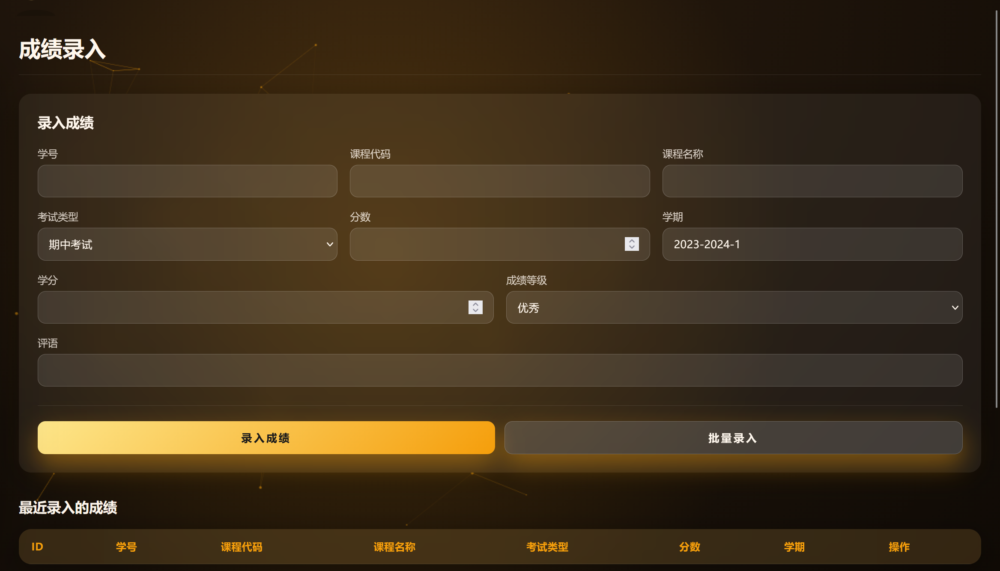

成绩录入完成后，系统会自动进行数据验证。分数范围检查确保成绩在0-100之间，等级转换根据分数自动评定成绩等级。

#### 3.3.2 补考审批

补考审批功能处理学生的补考申请。进入补考审批页面后，教师可以看到需要审批的补考申请列表，包括学生姓名、课程名称、原成绩、申请理由和申请时间。

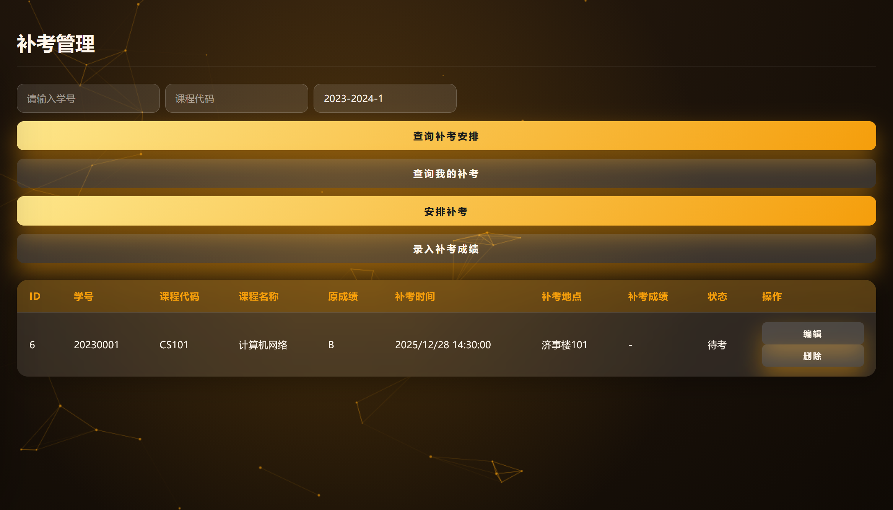

审批操作时，教师需要查看申请详情，确认申请信息的真实性。审批通过后，教师需要安排补考时间和地点，填写审批意见。补考时间必须是未来的某个日期，地点必须是系统已存在的教室。审批拒绝时，教师需要填写拒绝理由，该理由将通知给学生。

补考成绩录入功能用于在补考完成后记录补考成绩。教师选择已完成的补考记录，输入补考成绩和评语。成绩录入后，系统会自动更新补考记录的状态，并将新成绩与原成绩关联。教师可以查看补考记录列表，了解补考的整体情况。

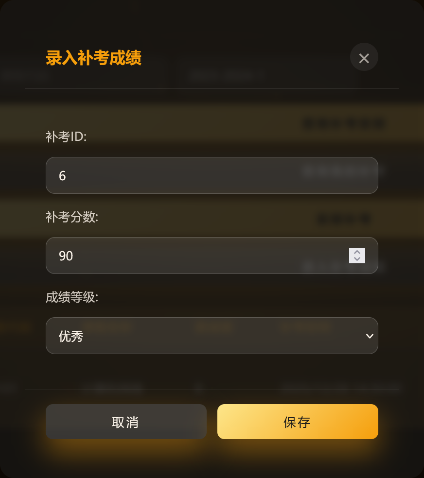

#### 3.3.3 教师课表管理

教师课表管理功能允许教师为所教授课程创建和更新教学课表。进入教师课表管理页面后，教师可以看到自己负责的课程列表。

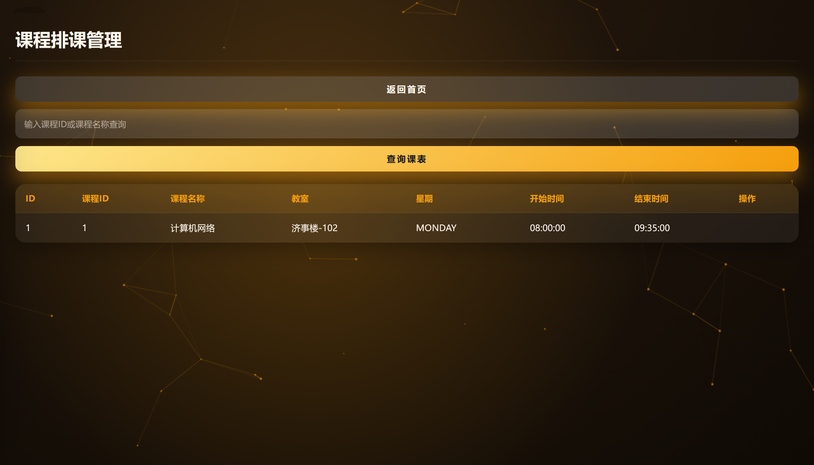


### 3.4 学生操作指南

#### 3.4.1 成绩查询

学生可以通过成绩查询功能查看个人学业成绩。进入成绩查询页面后，学生可以看到自己的成绩列表，包括课程名称、学分、成绩、等级和GPA等信息。

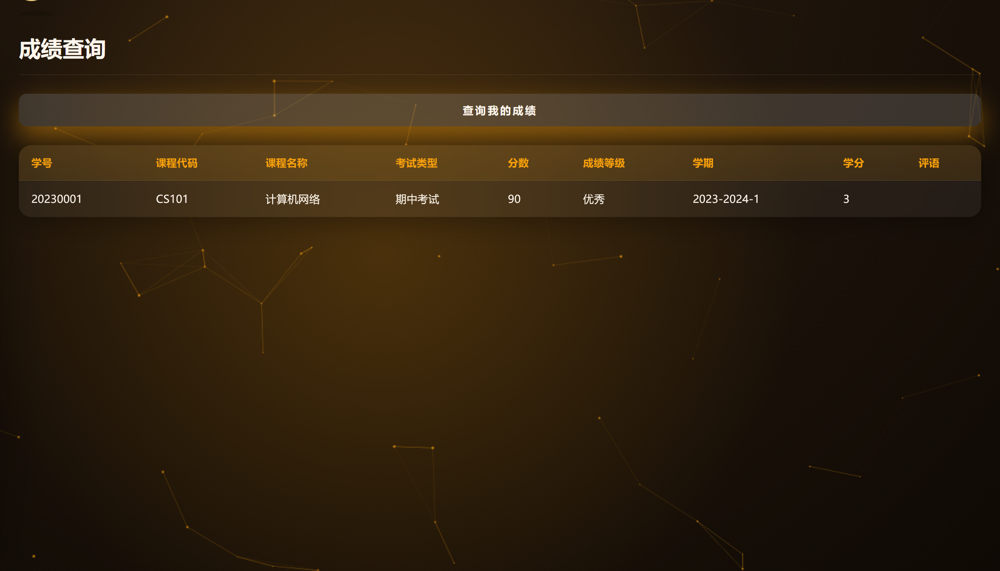

成绩单生成功能允许学生获取格式规范的学业成绩证明。学生可以选择学期，生成该学期的成绩单PDF文件，包含课程列表、学分统计、平均分和GPA等信息。成绩单可用于奖学金申请、出国留学材料等正式用途。

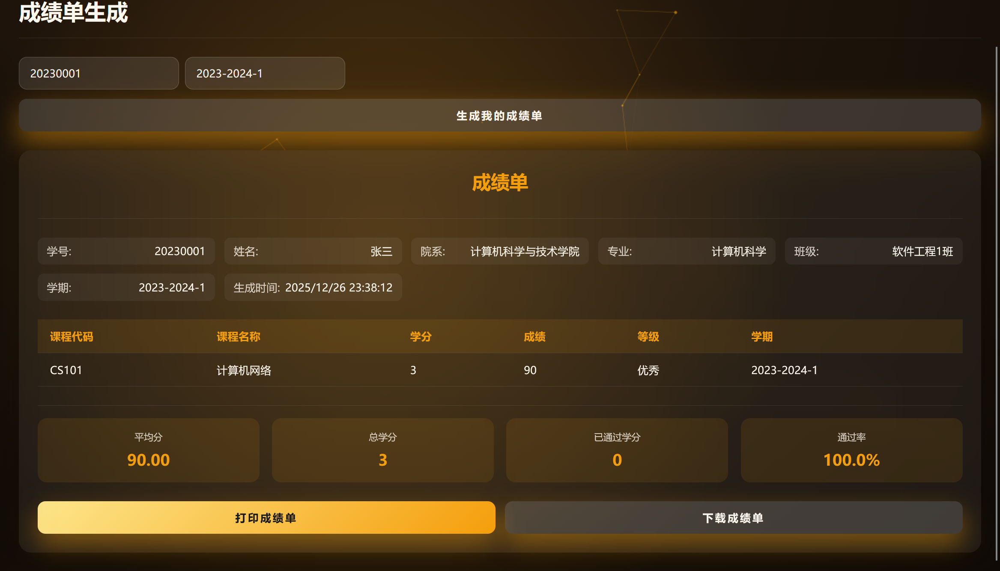

- 打印表单：

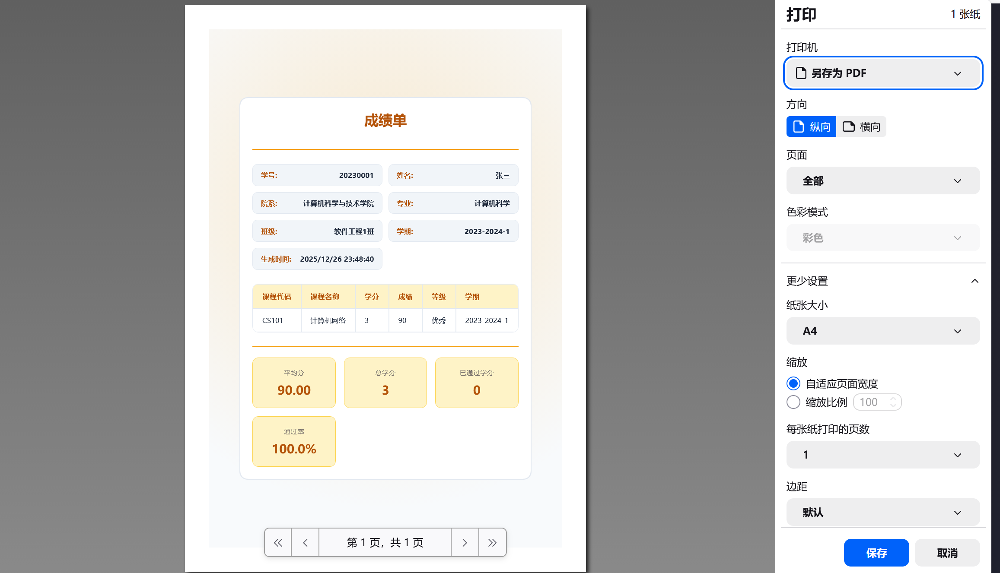


#### 3.4.2 选课与退课

选课功能允许学生选择下学期或当前学期需要学习的课程。进入选课页面后，学生可以看到可选课程列表，包括课程名称、授课教师、上课时间、学分和余量信息。

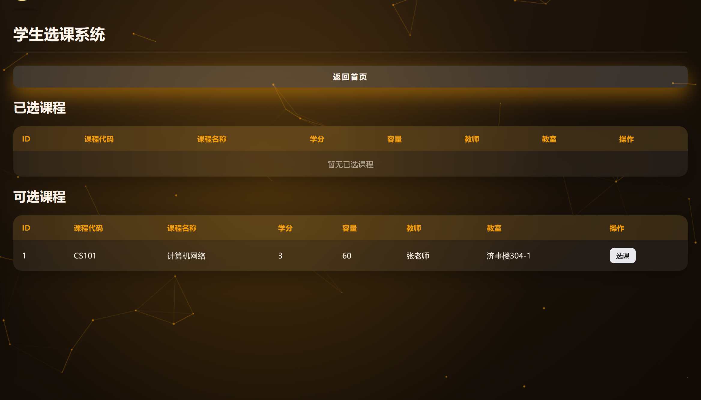

选课时，学生点击课程查看详情，包括课程简介、先修要求、授课教师简介等。确认选课后，系统会检查选课条件：先修课程是否已完成、选课人数是否已满、选课时间是否冲突。条件满足则选课成功，学生可以在课表中看到该课程；条件不满足则选课失败，系统会提示具体原因。

退课功能允许学生在规定时间内取消已选的课程。进入已选课程页面，选择需要退课的课程，确认退选操作。退课后，系统释放选课名额，更新课程统计。退选有截止日期限制，超过截止日期通常不允许退选。

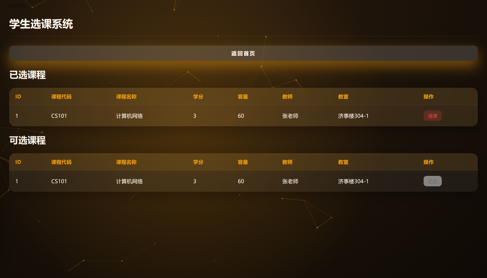

#### 3.4.3 课表查询

学生课表页面展示学生的个人课程表。进入课表页面后，学生可以看到当前学期的课程安排。

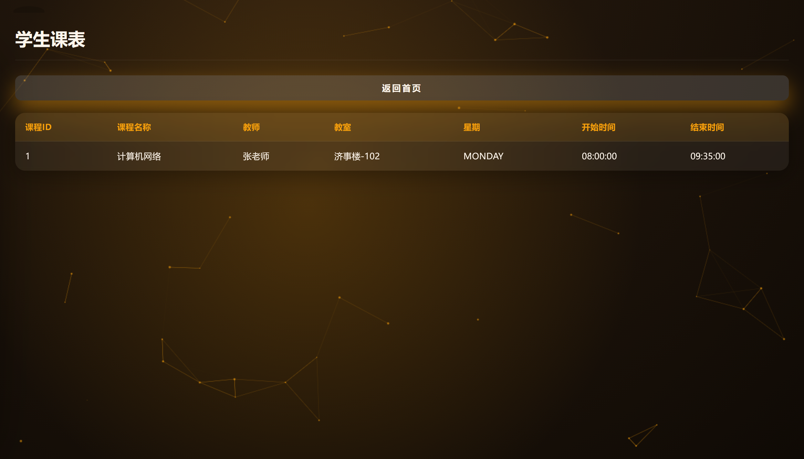

每门课程显示课程名称、上课时间、上课地点和授课教师。学生可以点击课程查看详细信息，如课程简介、教学大纲等。课表支持周视图和列表视图两种展示方式，学生可以根据习惯选择。学期切换功能允许学生查看不同学期的课表安排。

#### 3.4.4 学费缴纳

学费缴纳功能处理学生的学费缴纳事务。进入学费查询页面后，学生可以看到待缴纳的学费列表，包括学费金额、截止日期和缴费状态。

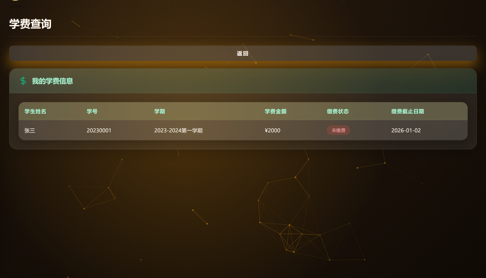

缴纳学费时，学生点击缴费按钮进入缴费页面。系统支持多种缴费方式，学生选择方便的方式完成支付。支付成功后，系统自动更新缴费状态，生成缴费记录。学生可以查看历史缴费记录，了解缴费详情。

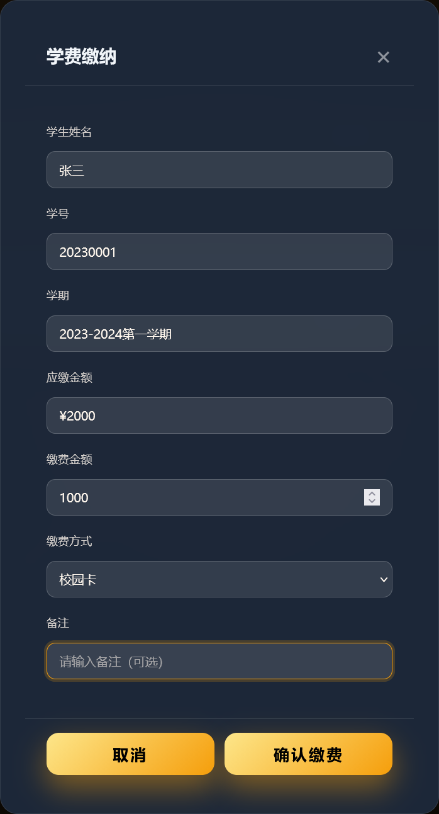

### 3.5 部署配置指南

#### 3.5.1 环境要求

智慧校园管理系统的部署需要满足以下环境要求。操作系统方面，系统支持Windows、Linux和macOS等主流操作系统。Java环境方面，系统要求JDK 17或更高版本。数据库方面，开发环境使用H2嵌入式数据库。

硬件配置方面，建议服务器至少配备2核CPU、4GB内存。网络方面，服务器需要开放HTTP（80端口）和HTTPS（443端口）访问，以便Web浏览器和移动应用访问系统服务。

#### 3.5.2 配置文件说明

系统的核心配置文件位于`src/main/resources/application.yml`。该文件定义了应用的运行参数、数据源配置和安全设置等。

数据源配置示例：
```yaml
spring:
  datasource:
    url: jdbc:h2:mem:testdb;DB_CLOSE_DELAY=-1;DB_CLOSE_ON_EXIT=FALSE
    username: sa
    password:
    driver-class-name: org.h2.Driver
  jpa:
    hibernate:
      ddl-auto: update
    show-sql: true
```

JWT安全配置需要设置密钥和过期时间：
```yaml
jwt:
  secret: your-256-bit-secret-key-for-jwt-token-signing
  expiration: 86400000
```

#### 3.5.3 编译与运行

项目使用Maven作为构建工具。首次编译时，执行以下命令下载依赖并编译项目：
```bash
mvn clean install -DskipTests
```

编译完成后，运行应用程序：
```bash
java -jar target/smart-campus-0.0.1-SNAPSHOT.jar
```

或者使用Maven直接运行：
```bash
mvn spring-boot:run
```

默认情况下，应用监听8081端口。打开浏览器访问`http://localhost:8081`，可以看到系统欢迎页面。API文档地址为`http://localhost:8081/swagger-ui.html`。


#### 3.5.4 Docker容器化部署

系统支持使用Docker容器化部署。项目根目录包含Dockerfile文件，可以直接构建镜像。

系统使用H2文件数据库进行数据本地持久化存储，通过Docker卷实现数据保存。

构建Docker镜像：
```bash
docker build -t smart-campus:latest .
```

运行容器：
```bash
docker run -d -p 8081:8081 -v h2-data:/data --name smart-campus smart-campus:latest
```

使用Docker Compose可以同时启动应用服务：
```yaml
version: '3.8'
services:
  smart-campus:
    build: .
    container_name: smart-campus-app
    ports:
      - "8081:8081"
    volumes:
      - h2-data:/data
    environment:
      - SPRING_PROFILES_ACTIVE=prod
      - SPRING_DATASOURCE_URL=jdbc:h2:file:/data/smartcampus;DB_CLOSE_DELAY=-1;MODE=MYSQL;DATABASE_TO_LOWER=TRUE
      - SPRING_DATASOURCE_DRIVER_CLASS_NAME=org.h2.Driver
      - SPRING_DATASOURCE_USERNAME=sa
      - SPRING_DATASOURCE_PASSWORD=
      - SPRING_JPA_HIBERNATE_DDL_AUTO=create-drop
    restart: unless-stopped

volumes:
  h2-data:
```

### 端口说明

| 端口 | 用途 |
|------|------|
| 8081 | 应用主端口，Web访问和API接口 |

### 数据库访问

容器启动后，数据存储在Docker卷 `h2-data` 中。H2数据库仅支持容器内访问，连接方式为：
```
jdbc:h2:file:/data/smartcampus
```

> **注意**: 本部署方案不暴露H2数据库TCP端口，不支持外部数据库连接工具直接访问。如需外部访问，请通过应用API接口或修改docker-compose.yml添加9092端口映射。


