# 智慧校园管理系统项目报告

## 目录

1. [引言](#引言)
2. [系统功能和特性](#系统功能和特性)
3. [用户手册和部署配置](#用户手册和部署配置)
4. [系统架构和组件设计](#系统架构和组件设计)
5. [数据存储设计](#数据存储设计)


## 引言

智慧校园管理系统是一个基于Spring Boot框架开发的现代化教育管理平台，旨在为学校提供全方位的数字化管理解决方案。该系统采用前后端分离架构，后端提供RESTful API接口，前端可使用任意支持HTTP请求的技术栈进行开发。系统涵盖了用户认证、成绩管理、课程管理、预约服务、学费管理、奖学金管理、课表管理等核心功能模块，支持管理员、教师和学生三类用户角色，通过基于JWT的安全认证机制确保系统的访问安全。

本系统采用Spring Boot 3.5.8作为后端框架，Spring Data JPA作为数据持久层解决方案，Spring Security结合JWT实现安全认证，Swagger/OpenAPI 3提供完整的API文档支持。数据库层面采用H2嵌入式数据库，便于开发测试环境快速部署。系统通过分层架构设计，实现了表现层、业务逻辑层和数据访问层的有效分离，确保了代码的可维护性和可扩展性。

智慧校园管理系统的价值在于实现校园管理流程的数字化转型，将传统的手工管理模式转变为高效、规范的电子化管理方式。教师可以通过系统便捷地管理课程信息、录入学生成绩、审批补考申请，学生可以在线查询成绩、选课、查看课表、缴纳学费，管理员则可以全面掌控用户权限、数据统计和系统配置等关键事务。系统还提供了完善的财务管理和报表统计功能，为学校管理决策提供数据支撑。


## 2. 系统功能和特性

- 系统模块功能图如下：


<center> 

**图2-1：智慧校园管理系统模块功能图** 

</center>

系统模块功能图展示了智慧校园管理系统的模块划分和功能组成。系统采用模块化设计，分为核心业务模块和资源管理模块两大类，共包含10个功能模块。

核心业务模块涵盖6个与教学管理直接相关的功能模块：用户认证与权限管理模块提供身份认证和访问控制；成绩管理模块支持成绩的录入、查询、统计和分析；课程管理模块实现课程的创建、选课和教学大纲管理；课表管理模块提供课表的创建和查询功能；预约管理模块实现各类资源的在线预约；补考管理模块处理补考的申请和成绩管理。

资源管理模块包含4个支持性功能模块：财务管理模块处理学费缴纳和奖学金发放；教室管理模块维护教室信息和分配；通知公告模块提供信息发布能力；系统报表模块生成各类统计分析报表。

### 2.1 用户认证与权限管理模块

| 功能名称 | 功能描述 | 用户角色 | 核心特性 |
|-|-|-|-|
| 用户登录 | 提供基于用户名密码的身份认证，生成JWT Token | 所有用户 | 支持多种用户类型，自动Token生成 |
| 用户注册 | 创建新用户账户 | 管理员 | 支持批量导入，邮箱唯一性校验 |
| 权限验证 | 拦截非法请求，验证用户权限 | 所有用户 | 基于角色，细粒度权限控制 |
| Token刷新 | 延长用户会话有效期 | 所有用户 | 自动过期检测 |

用户认证模块是智慧校园系统的基础安全组件，负责处理所有用户的身份验证和访问控制需求。该模块采用了业界广泛认可的JWT（JSON Web Token）认证机制，相比传统的Session认证方式，JWT具有无状态、可扩展、跨域友好等显著优势，特别适合前后端分离架构的应用场景。

用户登录流程为：用户提交用户名、密码和用户类型信息后，系统首先验证凭据的有效性，验证通过后生成包含用户身份信息的JWT Token，该Token将在后续的API请求中作为身份凭证使用。Token的有效期设置为24小时，既保证了用户的使用便利性，又控制了安全风险。系统支持三种用户类型：管理员（ADMIN）、教师（TEACHER）和学生（STUDENT），每种角色拥有不同的权限集合。

权限管理采用了基于角色的访问控制模型，系统预定义了角色和权限，用户被分配到相应的角色从而获得对应的操作权限。角色权限的关联通过中间表实现，支持灵活的角色权限配置。管理员可以在系统中创建自定义角色，分配不同的权限组合，满足学校组织架构的复杂需求。


### 2.2 成绩管理模块

| 功能名称 | 功能描述 | 用户角色 | 核心特性 |
|-|-|-|-|
| 成绩录入 | 为选课学生录入多种类型成绩 | 教师 | 支持平时、期中、期末成绩自动计算 |
| 成绩查询 | 查看个人或课程成绩记录 | 所有用户 | 多维度查询，成绩单生成 |
| 成绩统计 | 分析成绩分布和统计指标 | 教师、管理员 | 平均分、及格率、成绩分布分析 |
| 等级评定 | 根据分数自动评定成绩等级 | 系统 | 自动GPA转换，支持多种评分标准 |
| 成绩修改 | 修改已录入的成绩记录 | 教师 | 记录修改历史，权限控制 |

成绩录入功能支持教师为选课学生录入多种类型的成绩，包括平时成绩、期中成绩、期末成绩和总评成绩。系统会自动根据预设的权重比例计算总评成绩，并根据分数自动评定等级（优秀、良好、中等、及格、不及格）。成绩录入过程中，系统会进行数据有效性验证，包括分数范围检查、重复录入检测等，确保成绩数据的准确性和一致性。

成绩查询功能支持多维度的成绩查询需求。学生可以查看个人所有学期的成绩记录，包括各门课程的成绩、学分、等级和GPA统计。教师可以查询所教授课程的所有学生成绩，支持按学期、课程等条件筛选。管理员拥有全局成绩查询权限，可以进行全校范围的成绩统计分析。系统还提供了成绩单生成功能，学生可以获取格式规范的学期成绩单，包含课程名称、学分、成绩、排名等详细信息。

成绩统计分析功能为教学管理决策提供数据支持。教师可以查看课程成绩分布、平均分、最高分、最低分、及格率等统计指标，识别教学过程中的薄弱环节。系统支持按班级、年级、专业等多维度进行成绩对比分析，帮助管理者了解教学效果。

成绩查询功能支持多维度的成绩查询需求。学生可以查看个人所有学期的成绩记录，包括各门课程的成绩、学分、等级和GPA统计。教师可以查询所教授课程的所有学生成绩，支持按学期、课程等条件筛选。管理员拥有全局成绩查询权限，可以进行全校范围的成绩统计分析。系统还提供了成绩单生成功能，学生可以获取格式规范的学期成绩单，包含课程名称、学分、成绩、排名等详细信息。

成绩统计分析功能为教学管理决策提供数据支持。教师可以查看课程成绩分布、平均分、最高分、最低分、及格率等统计指标，识别教学过程中的薄弱环节。系统支持按班级、年级、专业等多维度进行成绩对比分析，帮助管理者了解教学效果。

### 2.3 课程管理模块

| 功能名称 | 功能描述 | 用户角色 | 核心特性 |
|-|-|-|-|
| 课程创建 | 创建新课程记录 | 管理员、教师 | 支持批量导入，课程代码唯一性校验 |
| 课程修改 | 修改课程基本信息 | 管理员、教师 | 记录修改历史，软删除支持 |
| 课程查询 | 查看课程列表和详情 | 所有用户 | 多条件筛选，按状态过滤 |
| 选课管理 | 学生选择或取消课程 | 学生 | 条件检查，时间冲突检测 |
| 教学大纲 | 管理课程教学大纲 | 教师 | 教学目标、内容、考核方式管理 |
| 课程状态管理 | 控制课程生命周期 | 管理员 | 草稿、发布、进行中、结束状态流转 |

课程创建功能允许管理员和教师创建新课程记录，每门课程包含课程代码、课程名称、学分、教师、上课教室和容量等基本信息。课程代码作为唯一标识符，确保了课程信息的准确性和可追溯性。系统支持课程的批量导入，便于开学前的课程准备工作。教师可以查看自己教授的课程列表，了解课程的基本信息和选课情况。

课程信息维护功能支持对课程基本信息的修改，包括课程名称、学分、容量等字段的更新。系统会记录课程信息的修改历史，便于追溯和管理。对于不再开设的课程，系统支持软删除机制，保留历史数据的同时将其标记为非活跃状态。

选课管理功能实现了学生自主选课和退选的完整流程。学生在可选课程列表中浏览课程信息，包括课程简介、先修要求、授课教师、上课时间等，然后决定是否选课。选课过程中系统会检查选课条件，如先修课程是否完成、选课人数是否已满等。退选功能允许学生在规定时间内取消选课，系统会自动释放选课名额，更新课程统计信息。

教学大纲管理功能为每门课程提供详细的教学大纲维护能力。教师可以编辑课程的教学目标、教学内容、考核方式、参考教材等信息，形成规范的教学大纲文档。学生可以查看课程的的教学大纲，了解课程的学习目标和内容安排。

### 2.4 课表管理模块

| 功能名称 | 功能描述 | 用户角色 | 核心特性 |
|-|-|-|-|
| 学生课表查询 | 查看个人学期课程表 | 学生 | 按周一至周五展示，自动整合选课记录 |
| 教师课表查询 | 查看所教授课程时间安排 | 教师 | 按学期查询，教学任务视图 |
| 课表创建 | 创建课程时间安排 | 管理员、教师 | 时间冲突检测，教室占用检查 |
| 课表修改 | 修改课表记录信息 | 管理员、教师 | 冲突检测，确保教学秩序 |
| 课表删除 | 删除课表记录 | 管理员、教师 | 检查关联课程，影响评估 |
| 教室查询 | 查询教室占用情况 | 所有用户 | 实时状态，多条件筛选 |

课表管理模块是智慧校园系统中管理教学时间安排的核心组件，为学生和教师提供课表查询服务，支持按学生、教师、学期等多个维度查询课程时间安排。该模块与课程管理、教室管理模块紧密集成，确保教学资源的合理分配。

学生课表查询功能允许学生查看个人学期课程表，按周一至周五的顺序展示每天的课程安排，包括课程名称、上课时间、上课地点和授课教师等信息。系统会自动整合学生的选课记录，生成个性化的课表视图。学生可以选择查看不同学期的课表，了解各学期的课程安排情况。

教师课表查询功能为教师提供所教授课程的时间安排视图。教师可以查看自己每周的教学安排，包括上课时间、课程名称、上课教室和学生班级等信息。系统支持按学期查询，便于教师了解不同学期的教学任务。

课表管理功能支持管理员和教师创建、修改和删除课表记录。创建课表时，系统会检查时间冲突和教室占用情况，避免同一时间同一教室安排多门课程。课表的修改和删除操作同样会进行冲突检测，确保教学秩序的稳定。

### 2.5 预约管理模块

| 功能名称 | 功能描述 | 用户角色 | 核心特性 |
|-|-|-|-|
| 预约创建 | 创建新的预约记录 | 学生 | 服务类型选择，时间可用性检查 |
| 预约查询 | 查看个人预约记录 | 所有用户 | 按状态筛选，时间排序 |
| 预约管理 | 管理预约状态 | 管理员、服务提供者 | 确认、拒绝、安排服务时间 |
| 预约提醒 | 发送预约提醒通知 | 系统 | 预约临近提醒，状态通知 |
| 服务类型管理 | 配置预约服务类型 | 管理员 | 灵活配置，类型维护 |

预约管理模块为学生提供各类校园服务预约功能，包括学业咨询预约、实验室预约、心理咨询预约等。该模块的设计注重预约流程的规范性和时间管理的合理性，确保预约资源的高效利用。

预约创建功能允许学生选择服务类型和预约时间，系统会检查所选时间是否可用，避免时间冲突。预约服务类型支持灵活配置，管理员可以根据学校实际需求添加新的服务类型。预约创建成功后，系统会生成预约记录，并发送确认通知。

预约管理功能支持预约状态的全程跟踪。学生可以查看自己的预约记录，了解预约状态（待确认、已确认、已完成、已取消等）。管理员和服务提供者可以管理预约记录，确认或拒绝预约请求，安排服务时间。系统还支持预约提醒功能，在预约时间临近时向相关人员发送提醒通知。

### 2.6 补考管理模块

| 功能名称 | 功能描述 | 用户角色 | 核心特性 |
|-|-|-|-|
| 补考申请 | 提交补考申请 | 学生 | 原成绩验证，申请期限检查 |
| 补考审批 | 审核补考申请 | 教师 | 安排补考时间地点，审批意见记录 |
| 补考成绩录入 | 录入补考成绩 | 教师 | 成绩关联，状态自动更新 |
| 补考查询 | 查询补考记录 | 所有用户 | 状态跟踪，流程追溯 |
| 补考通知 | 生成并发送补考通知 | 系统 | 自动通知，通知单生成 |

补考管理模块提供了完整的补考申请和审批流程，实现了补考事务的规范化管理。该模块连接了成绩管理和考试管理两个核心业务，为学生提供补考申请入口，为教师提供审批和成绩录入功能。

补考申请功能允许不及格课程的学生提交补考申请。学生选择需要补考的原成绩记录，填写申请理由和期望的补考时间，提交给授课教师审批。系统会验证申请的有效性，如检查原成绩是否真实存在、是否在有效申请期内等。申请提交后，系统自动通知相关教师进行审批。

补考审批功能为教师提供补考申请的审批界面。教师可以查看申请详情，包括学生信息、原成绩信息、申请理由等，然后做出批准或拒绝的决定。审批通过后，教师需要安排补考时间和地点，填写审批意见。系统会记录完整的审批流程，便于追溯和统计。

补考成绩录入功能允许教师为已完成的补考录入成绩。成绩录入后，系统会自动更新补考记录状态，并将新成绩关联到原成绩记录，便于成绩追溯和统计分析。


### 2.7 财务管理模块

| 功能名称 | 功能描述 | 用户角色 | 核心特性 |
|-|-|-|-|
| 学费管理 | 设定学费标准，生成账单 | 管理员 | 自动账单生成，缴费状态跟踪 |
| 奖学金管理 | 创建和管理奖学金 | 管理员 | 申请条件配置，评审流程管理 |
| 助学金管理 | 处理助学金申请和发放 | 管理员、学生 | 申请审核，发放记录 |
| 缴费记录 | 记录学生缴费历史 | 所有用户 | 多方式支持，完整历史追溯 |
| 财务统计 | 生成财务报表和统计 | 管理员 | 多维度报表，数据汇总 |

财务管理模块涵盖学费管理、奖学金管理、助学金管理和缴费记录管理四个子模块，为学校的财务管理工作提供全面的信息化支撑。该模块的设计注重财务数据的准确性和可追溯性，支持多维度的财务报表生成。

学费管理功能支持学费标准的设定、学费账单的生成和学生缴费状态的跟踪。管理员可以为每位学生创建学费记录，设置学费金额、缴费截止日期等信息。系统自动生成学费账单，学生可以查看个人学费明细和缴费状态。缴费完成后，系统更新缴费状态并生成缴费记录。


奖学金管理功能支持各类奖学金的创建、申请和发放管理。管理员可以定义奖学金的名称、金额、类型、申请条件和时间范围。学生可以查看可申请的奖学金列表，提交申请材料。教师和管理员负责奖学金的评审工作，评审通过后系统记录奖学金发放信息。

助学金管理功能为家庭经济困难学生提供助学金申请渠道。学生可以提交助学金申请，说明家庭经济情况和申请理由。系统支持助学金的审核流程，审核通过后发放助学金到学生账户。助学金的申请、审核和发放过程全程记录，确保助学金管理的公平公正。

缴费记录管理功能记录所有学生的缴费历史，包括缴费金额、缴费方式、缴费时间等信息。系统支持多种缴费方式的记录，如银行转账、在线支付、现金缴纳等。每条缴费记录都关联到具体的学费账单，确保财务数据的完整性。

### 2.8 教室管理模块

| 功能名称 | 功能描述 | 用户角色 | 核心特性 |
|-|-|-|-|
| 教室信息维护 | 增删改查教室基本信息 | 管理员 | 教室名称、位置、容量、设备管理 |
| 教室查询 | 多条件查询可用教室 | 所有用户 | 按教学楼、容量、状态筛选 |
| 教室统计 | 统计教室使用情况 | 管理员 | 使用率统计，占用情况分析 |
| 教室设备管理 | 管理教室教学设施 | 管理员 | 设备信息维护，状态更新 |

教室管理模块提供教室资源的全面管理功能，包括教室信息维护、教室查询和教室使用情况统计。该模块与课程管理、课表管理模块配合使用，确保教室资源的合理分配和高效利用。

教室信息维护功能支持教室基本信息的增删改查，包括教室名称、位置、容量和设备信息。教室名称和位置共同构成教室的唯一标识，便于识别和查询。容量信息用于课程安排时的教室选择，确保教室容量满足教学需求。设备信息记录教室配备的教学设施，如投影仪、空调、音响等。

教室查询功能提供多种查询方式，支持按教学楼查询、按容量查询和可用教室查询。系统会实时计算教室的占用状态，返回指定条件下的可用教室列表，便于课程安排和临时借用。

### 2.9 通知公告模块

| 功能名称 | 功能描述 | 用户角色 | 核心特性 |
|-|-|-|-|
| 通知创建 | 创建新通知信息 | 管理员 | 支持多种通知类型，富文本格式 |
| 通知发送 | 向用户推送通知 | 管理员、系统 | 支持个人、群体、全局发送 |
| 通知查询 | 查看收到的通知 | 所有用户 | 按类型、状态、时间筛选 |
| 通知阅读 | 标记通知已读状态 | 所有用户 | 阅读状态跟踪，未读计数 |
| 通知管理 | 管理和维护通知 | 管理员 | 通知编辑、删除、撤回 |

通知公告模块为系统提供消息通知能力，支持向特定用户或用户群体推送通知信息。该模块用于系统内部的消息传递，如补考申请审批结果、缴费提醒、课程变动通知等。

通知管理功能支持通知的创建、发送和查询。系统支持多种通知类型，如系统通知、个人通知、群体通知等。通知内容可以包含标题、正文和附件，支持富文本格式。发送通知时，可以选择发送给特定用户、用户角色或全体用户。

通知查询功能允许用户查看个人收到的通知列表，包括通知标题、发送时间、已读状态等信息。用户可以点击查看通知详情，并将重要通知标记为已读。系统会记录通知的阅读状态，便于发送者了解通知的触达情况。

### 2.10 系统报表模块

| 功能名称 | 功能描述 | 用户角色 | 核心特性 |
|-|-|-|-|
| 成绩统计报表 | 成绩分布和学业分析 | 教师、管理员 | 多维度筛选，对比分析 |
| 财务统计报表 | 财务收支和缴费统计 | 管理员 | 收缴率统计，发放汇总 |
| 选课统计报表 | 课程选修情况分析 | 教师、管理员 | 热门课程，退选率分析 |
| 用户统计报表 | 用户活跃度和行为分析 | 管理员 | 登录统计，使用情况 |
| 报表导出 | 生成和导出报表数据 | 管理员 | 支持多种格式，定制导出 |

系统报表模块提供数据统计和报表生成功能，为学校管理决策提供数据支持。该模块整合了系统各业务模块的关键数据，生成可视化的统计报表。

成绩统计报表展示全校或特定范围的学业成绩分布情况，包括平均分、及格率、各等级人数比例等指标。报表支持按年级、专业、班级、课程等多维度进行筛选和对比分析。

财务统计报表汇总学校的财务收支情况，包括学费收缴率、奖学金发放统计、助学金发放统计等。报表支持按学期、学年进行时间维度的对比分析。

选课统计报表反映课程选修的热门程度，包括选课人数、选课率、退选率等指标。教师可以了解课程的受欢迎程度，管理者可以优化课程设置和资源配置。


## 3. 用户手册和部署配置

### 3.1 系统概述与快速入门

智慧校园管理系统是一个功能完整的教育管理平台，支持管理员、教师和学生三类用户角色。管理员拥有系统的最高权限，可以管理用户账户、配置系统参数、查看全局数据报表。教师可以管理课程信息、录入学生成绩、审批补考申请、查看教学相关统计。学生可以查看个人成绩、选课、缴纳学费、查询课表等。本手册将详细介绍系统的各项功能操作和配置方法，帮助用户快速上手使用系统。

系统采用Web浏览器作为客户端，用户只需在浏览器中输入系统地址即可访问。系统支持主流浏览器，包括Chrome、Firefox、Edge和Safari。建议使用最新版本的浏览器以获得最佳的使用体验。首次访问系统时，用户需要使用分配的用户名和密码登录，登录成功后即可进入系统主页，根据角色权限使用各项功能。

### 3.2 管理员操作指南

#### 3.2.1 用户管理

管理员在用户管理模块中可以执行用户账户的创建、查询、修改和删除操作。进入用户管理页面后，可以看到系统所有用户的列表，包括用户名、真实姓名、用户类型、邮箱、状态和创建时间等信息。


创建新用户时，点击"注册新用户"按钮，填写用户基本信息表单，系统会进行自动校验。创建用户时，可以直接为用户分配角色，用户将获得该角色的所有权限。用户创建成功后，系统会分配一个用户ID，后续操作可以使用该ID引用用户。


用户信息查看功能允许管理员更新用户的个人信息和状态。对于密码重置，管理员可以设置用户的新密码，用户下次登录时需要使用新密码。


#### 3.2.2 课程管理

管理员在课程管理模块中可以管理系统所有课程的信息。进入课程管理页面后，可以查看课程列表，包括课程代码、课程名称、学分、教师、上课教室和容量等信息。


课程信息修改功能允许管理员调整课程的基本信息，如课程名称、学分、容量等。当课程已经开始授课时，修改操作需要谨慎进行，特别是容量调整可能影响已选课学生的人数限制。


#### 3.2.3 教室管理

教室管理模块提供教室资源的维护功能。进入教室管理页面后，可以看到所有教室的列表，包括教室名称、位置、容量和设备信息。


创建新教室时，需要填写教室的基本信息。教室名称建议使用"教学楼-房间号"的格式，如"教学楼A101"。位置信息描述教室的具体位置，帮助用户快速找到教室。容量字段设定教室可容纳的学生人数，用于课程安排时的容量检查。设备字段描述教室配备的教学设施，如投影仪、麦克风、白板等。


#### 3.2.4 学费管理

学费管理模块处理学生的学费缴纳相关事务。进入学费管理页面后，可以看到所有学费记录的列表，包括学生姓名、学费金额、学期、缴费状态和截止日期等信息。


创建学费记录时，需要选择学生、设定学费金额、选择学期和设置缴费截止日期。学费金额以元为单位，支持小数。学期字段用于标识学费所属的学年学期，如"2023-2024学年第一学期"。截止日期是学生缴费的最后期限，超期未缴费的学生可能面临选课限制或其他影响。


### 3.3 教师操作指南

#### 3.3.1 成绩录入

成绩录入是教师最常用的功能之一。进入成绩管理页面后，教师可以看到自己所教授课程的列表。选择课程后，可以查看该课程所有学生的成绩列表，包括学号、姓名、各类成绩和总评成绩。

【截图位置：成绩管理课程列表页面 - 显示教师所教授的课程列表】

录入新成绩时，点击"录入成绩"按钮，选择学生、设定考试类型和输入各项成绩分数。系统支持多种考试类型的成绩录入，如平时作业、期中考试、期末考试等。教师需要分别输入平时成绩、期中成绩和期末成绩，系统会自动根据预设的权重计算总评成绩。总评成绩计算公式为：总评成绩 = 平时成绩 × 20% + 期中成绩 × 30% + 期末成绩 × 50%。

【截图位置：成绩录入表单页面 - 显示学生选择、考试类型、平时成绩、期中成绩、期末成绩等字段】

成绩录入完成后，系统会自动进行数据验证。分数范围检查确保成绩在0-100之间，等级转换根据分数自动评定成绩等级。教师可以查看成绩统计信息，包括平均分、最高分、最低分、及格人数和不及格人数等。如果发现成绩录入错误，教师可以修改成绩记录，系统会记录修改历史。

【截图位置：成绩统计页面 - 显示平均分、最高分、最低分、及格率等统计数据】

#### 3.3.2 补考审批

补考审批功能处理学生的补考申请。进入补考审批页面后，教师可以看到需要审批的补考申请列表，包括学生姓名、课程名称、原成绩、申请理由和申请时间。

【截图位置：补考申请列表页面 - 显示待审批的补考申请列表】

审批操作时，教师需要查看申请详情，确认申请信息的真实性。审批通过后，教师需要安排补考时间和地点，填写审批意见。补考时间必须是未来的某个日期，地点必须是系统已存在的教室。审批拒绝时，教师需要填写拒绝理由，该理由将通知给学生。

【截图位置：补考审批详情页面 - 显示申请详情和审批操作表单】

补考成绩录入功能用于在补考完成后记录补考成绩。教师选择已完成的补考记录，输入补考成绩和评语。成绩录入后，系统会自动更新补考记录的状态，并将新成绩与原成绩关联。教师可以查看补考记录列表，了解补考的整体情况。

【截图位置：补考成绩录入页面 - 显示补考记录和成绩输入表单】

#### 3.3.3 教学大纲管理

教学大纲管理功能允许教师为所教授课程创建和更新教学大纲。进入教学大纲管理页面后，教师可以看到自己负责的课程列表。点击课程可以查看现有的教学大纲内容。

【截图位置：教学大纲管理页面 - 显示课程列表和教学大纲编辑器】

创建教学大纲时，教师需要填写课程的教学目标、教学内容、考核方式和参考教材等信息。教学大纲是指导学生学习的重要文档，应该清晰描述课程的学习目标、主要内容、教学安排和考核标准。编辑完成后保存，教学大纲将对选课学生可见。

【截图位置：教学大纲编辑页面 - 显示教学目标、教学内容、考核方式、参考教材等编辑区域】

### 3.4 学生操作指南

#### 3.4.1 成绩查询

学生可以通过成绩查询功能查看个人学业成绩。进入成绩查询页面后，学生可以看到所有学期的成绩列表，包括课程名称、学分、成绩、等级和GPA等信息。

【截图位置：学生成绩查询页面 - 显示所有学期的成绩列表】

按学期筛选功能允许学生查看特定学期的成绩详情。学期选择后，页面显示该学期所有课程的成绩，包括平时成绩、期中成绩、期末成绩和总评成绩。学生可以点击单门课程查看详细的成绩构成，了解各部分成绩的占比和得分情况。

【截图位置：按学期筛选的成绩详情页面 - 显示单学期的课程成绩列表】

成绩单生成功能允许学生获取格式规范的学业成绩证明。学生可以选择学期，生成该学期的成绩单PDF文件，包含课程列表、学分统计、平均分和GPA等信息。成绩单可用于奖学金申请、出国留学材料等正式用途。

【截图位置：成绩单PDF预览页面 - 显示生成的PDF成绩单格式】

#### 3.4.2 选课与退课

选课功能允许学生选择下学期或当前学期需要学习的课程。进入选课页面后，学生可以看到可选课程列表，包括课程名称、授课教师、上课时间、学分和余量信息。

【截图位置：选课页面 - 显示可选课程列表】

选课时，学生点击课程查看详情，包括课程简介、先修要求、授课教师简介等。确认选课后，系统会检查选课条件：先修课程是否已完成、选课人数是否已满、选课时间是否冲突。条件满足则选课成功，学生可以在课表中看到该课程；条件不满足则选课失败，系统会提示具体原因。

【截图位置：课程详情对话框 - 显示课程简介、先修要求、教师简介等信息】

退课功能允许学生在规定时间内取消已选的课程。进入已选课程页面，选择需要退课的课程，确认退选操作。退课后，系统释放选课名额，更新课程统计。退选有截止日期限制，超过截止日期通常不允许退选。

【截图位置：退课确认对话框 - 显示退课操作确认和截止日期提示】

#### 3.4.3 课表查询

课表查询功能展示学生的个人课程表。进入课表页面后，学生可以看到当前学期的课程安排，按周一至周五展示每天的课程信息。

【截图位置：学生课表周视图页面 - 按周一至周五显示课程安排】

每门课程显示课程名称、上课时间、上课地点和授课教师。学生可以点击课程查看详细信息，如课程简介、教学大纲等。课表支持周视图和列表视图两种展示方式，学生可以根据习惯选择。学期切换功能允许学生查看不同学期的课表安排。

【截图位置：课表列表视图页面 - 以列表形式显示课程安排】

#### 3.4.4 学费缴纳

学费缴纳功能处理学生的学费缴纳事务。进入学费页面后，学生可以看到待缴纳的学费列表，包括学费金额、截止日期和缴费状态。

【截图位置：学生学费页面 - 显示待缴费和已缴费的学费列表】

缴纳学费时，学生点击缴费按钮进入缴费页面。系统支持多种缴费方式，学生选择方便的方式完成支付。支付成功后，系统自动更新缴费状态，生成缴费记录。学生可以查看历史缴费记录，了解缴费详情。

【截图位置：缴费页面 - 显示缴费金额、缴费方式选择和支付按钮】

### 3.5 部署配置指南

#### 3.5.1 环境要求

智慧校园管理系统的部署需要满足以下环境要求。操作系统方面，系统支持Windows、Linux和macOS等主流操作系统，建议使用Linux服务器以获得更好的稳定性和性能。Java环境方面，系统要求JDK 17或更高版本，建议使用Eclipse Temurin或Amazon Corretto等开源JDK发行版。数据库方面，开发环境使用H2嵌入式数据库，生产环境建议使用MySQL 8.0或PostgreSQL 14以上版本。

硬件配置方面，建议服务器至少配备2核CPU、4GB内存和50GB存储空间。对于学生人数超过5000人的大规模部署，建议配备4核以上CPU、8GB以上内存和100GB以上存储空间。网络方面，服务器需要开放HTTP（80端口）和HTTPS（443端口）访问，以便Web浏览器和移动应用访问系统服务。

#### 3.5.2 配置文件说明

系统的核心配置文件位于`src/main/resources/application.yml`。该文件定义了应用的运行参数、数据源配置和安全设置等。

数据源配置示例：
```yaml
spring:
  datasource:
    url: jdbc:h2:mem:testdb;DB_CLOSE_DELAY=-1;DB_CLOSE_ON_EXIT=FALSE
    username: sa
    password:
    driver-class-name: org.h2.Driver
  jpa:
    hibernate:
      ddl-auto: update
    show-sql: true
```

生产环境使用MySQL数据库时，配置应修改为：
```yaml
spring:
  datasource:
    url: jdbc:mysql://localhost:3306/smartcampus?useSSL=false&serverTimezone=UTC
    username: your_username
    password: your_password
    driver-class-name: com.mysql.cj.jdbc.Driver
  jpa:
    hibernate:
      ddl-auto: update
```

JWT安全配置需要设置密钥和过期时间：
```yaml
jwt:
  secret: your-256-bit-secret-key-for-jwt-token-signing
  expiration: 86400000
```

#### 3.5.3 编译与运行

项目使用Maven作为构建工具。首次编译时，执行以下命令下载依赖并编译项目：
```bash
mvn clean install -DskipTests
```

编译完成后，运行应用程序：
```bash
java -jar target/smart-campus-0.0.1-SNAPSHOT.jar
```

或者使用Maven直接运行：
```bash
mvn spring-boot:run
```

默认情况下，应用监听8081端口。打开浏览器访问`http://localhost:8081`，可以看到系统欢迎页面。API文档地址为`http://localhost:8081/swagger-ui.html`。


#### 3.5.4 Docker容器化部署

系统支持使用Docker容器化部署。项目根目录包含Dockerfile文件，可以直接构建镜像。

构建Docker镜像：
```bash
docker build -t smart-campus:latest .
```

运行容器：
```bash
docker run -d -p 8081:8081 --name smart-campus smart-campus:latest
```

使用Docker Compose可以同时启动应用和数据库服务：
```yaml
version: '3.8'
services:
  app:
    build: .
    ports:
      - "8081:8081"
    depends_on:
      - db
    environment:
      - SPRING_DATASOURCE_URL=jdbc:mysql://db:3306/smartcampus
      - SPRING_DATASOURCE_USERNAME=root
      - SPRING_DATASOURCE_PASSWORD=rootpassword

  db:
    image: mysql:8.0
    ports:
      - "3306:3306"
    environment:
      - MYSQL_ROOT_PASSWORD=rootpassword
      - MYSQL_DATABASE=smartcampus
    volumes:
      - mysql_data:/var/lib/mysql

volumes:
  mysql_data:
```


## 4. 系统架构和组件设计

### 4.1 整体架构概述


智慧校园管理系统采用经典的分层架构设计，从上到下依次为客户端层、应用层和数据层。

客户端层是用户与系统交互的入口，支持Web浏览器和移动应用两种访问方式。Web浏览器是最主要的访问方式，用户通过Chrome、Firefox、Edge等主流浏览器访问系统功能。系统的前端界面采用响应式设计，能够自适应不同尺寸的屏幕，提供良好的用户体验。移动应用可以通过调用系统的RESTful API接口访问后端服务，实现与Web端一致的功能。

应用层是系统的核心，包含Controller层、Service层和Repository层三个子层。Controller层处理HTTP请求，进行参数验证和响应格式转换；Service层实现业务逻辑，处理事务管理和数据验证；Repository层负责数据访问，封装与数据库的交互。系统安全认证功能通过Spring Security框架和JWT技术实现，集成在各层中，而非独立模块。

数据层负责数据的持久化存储和模型定义。Entity层定义系统的数据模型，与数据库表对应，包含实体映射和数据验证规则。系统使用Spring Data JPA作为ORM框架，通过面向对象的方式操作数据库。数据层支持H2嵌入式数据库用于开发测试，也支持MySQL和PostgreSQL等关系型数据库用于生产环境。此外，数据层还可以与外部服务集成，如邮件服务用于发送通知消息，文件存储服务用于保存用户上传的文件。

### 4.2 分层架构设计

#### 4.2.1 Controller层

Controller层是系统的最上层，负责接收和响应HTTP请求。该层的核心职责包括：解析请求参数、验证数据有效性、调用Service层处理业务逻辑、组装响应结果和返回HTTP响应。Controller层的设计遵循RESTful API规范，使用HTTP动词（GET、POST、PUT、DELETE）表示不同的操作，使用URL路径表示资源。

系统中的Controller类使用`@RestController`注解标记，并使用`@RequestMapping`注解定义基础路径。每个Controller方法使用`@GetMapping`、`@PostMapping`、`@PutMapping`、`@DeleteMapping`等注解定义处理的HTTP请求方法和路径。方法参数使用`@RequestParam`、`@PathVariable`、`@RequestBody`等注解绑定请求数据。

响应数据统一使用`ResponseEntity<T>`封装，包含HTTP状态码、响应头和响应体。系统定义了标准的响应格式，包含状态码、消息和数据三个字段，便于前端统一处理。异常处理使用`@ControllerAdvice`注解的全局异常处理器，统一捕获和处理业务异常和系统异常，返回规范的错误响应。

#### 4.2.2 Service层

Service层是系统的业务逻辑层，负责实现各种业务功能。该层的核心职责包括：业务规则验证、事务管理、调用Repository层进行数据操作和协调多个数据源的访问。Service层的设计遵循单一职责原则，每个Service类负责一个业务领域的逻辑。

Service类使用`@Service`注解标记，通常一个实体对应一个Service类，如UserService负责用户相关业务、GradeService负责成绩相关业务。Service方法的事务管理使用`@Transactional`注解，可以声明事务的传播行为、隔离级别和回滚规则。对于只读操作，配置`readOnly=true`以优化数据库访问性能。

Service层还负责数据验证和业务规则检查。参数验证通常在Controller层进行初步检查，但复杂的业务规则验证需要在Service层实现。例如，选课操作需要检查先修课程是否完成、选课人数是否已满、时间是否冲突等，这些逻辑在Service层实现。

#### 4.2.3 Repository层

Repository层是系统的数据访问层，负责与数据库交互。该层使用Spring Data JPA提供的接口和方法，通过面向对象的方式操作数据，无需编写SQL语句。Repository层的设计遵循数据访问对象模式，每个实体对应一个Repository接口。

Repository接口继承自`JpaRepository<T, ID>`或`PagingAndSortingRepository<T, ID>`，自动获得CRUD操作和分页查询的方法。对于复杂的查询，可以使用`@Query`注解编写自定义JPQL或SQL语句。方法命名遵循Spring Data JPA的命名规范，可以自动解析方法名生成查询，如`findByUsername`方法会根据属性名自动生成按用户名查询的语句。

Repository层的设计注重查询性能和数据一致性。对于高频查询，添加适当的索引以提升查询速度。对于关联查询，使用`@EntityGraph`或`@Query`显式定义关联数据的加载策略，避免N+1查询问题。

#### 4.2.4 Entity层

Entity层定义了系统的数据模型，与数据库表对应。每个Entity类使用`@Entity`注解标记，属性使用`@Column`注解映射数据库列。Entity类遵循JavaBean规范，提供无参构造函数和带参构造函数，使用Lombok注解简化getter和setter方法的编写。

Entity之间的关系使用JPA注解定义。一对一关系使用`@OneToOne`注解，一对多关系使用`@OneToMany`注解，多对一关系使用`@ManyToOne`注解，多对多关系使用`@ManyToMany`注解。关系映射可以选择立即加载（EAGER）或延迟加载（LAZY），延迟加载可以提高查询性能，但需要在事务内访问关联数据。

Entity类通常包含审计字段，如创建时间、更新时间、创建人、更新人等。使用Spring Data JPA的`@CreatedDate`和`@LastModifiedDate`注解自动填充这些字段。软删除通过在Entity中添加`deleted`标记字段实现，使用`@SQLDelete`和`@Where`注解实现删除操作的逻辑删除。

### 4.3 安全架构设计

#### 4.3.1 JWT认证机制

系统采用JWT（JSON Web Token）作为用户认证的解决方案。JWT是一种开放标准（RFC 7519），用于在各方之间安全地传输JSON格式的信息。相比传统的Session认证，JWT具有无状态、可扩展、跨域友好等优势，特别适合前后端分离架构。

JWT的组成包含三个部分：头部（Header）、载荷（Payload）和签名（Signature）。头部包含令牌类型和使用的算法，载荷包含用户身份信息和过期时间等声明，签名用于验证令牌的完整性。系统在用户登录成功后生成JWT，包含用户ID、用户名、角色等声明，设置24小时的有效期。

JWT的处理流程如下：


客户端发送登录请求，服务端验证用户名密码成功后，生成JWT并返回给客户端。客户端在后续请求中通过HTTP请求头（Authorization: Bearer <token>）携带JWT。服务端通过JWT过滤器验证令牌的有效性，解析用户信息并设置安全上下文。验证通过后，请求继续处理；验证失败时，返回401未授权错误。

#### 4.3.2 权限控制实现

权限控制基于Spring Security框架实现，采用方法级别的安全控制。系统使用`@PreAuthorize`注解在Controller和Service方法上声明访问权限，只有拥有相应权限的用户才能调用该方法。

权限检查支持多种表达式，如`hasRole('ADMIN')`检查用户是否拥有管理员角色，`hasAnyRole('ADMIN', 'TEACHER')`检查用户是否拥有任一角色，`hasPermission()`检查用户是否拥有特定权限。角色权限的对应关系存储在数据库中，支持运行时动态调整。

#### 4.3.3 接口安全设计

系统对API接口实施多层次的安全保护。认证层面，受保护的API需要携带有效的JWT令牌，系统会验证令牌的真伪和有效期。授权层面，根据用户角色限制API的访问权限，如成绩录入接口只有教师和管理员可以访问。

敏感操作实施双重验证，如删除操作需要确认操作。系统记录所有操作的审计日志，包括操作人、操作时间、操作内容和操作结果，便于安全审计和问题追溯。密码使用BCrypt算法加密存储，即使数据库泄露也无法直接获取用户密码。

接口还实施了基本的防护措施，包括请求频率限制防止暴力破解、输入验证防止SQL注入和XSS攻击、响应头安全设置防止点击劫持等。这些措施共同构成了系统的安全防线，保护系统和用户数据的安全。

### 4.4 模块间交互设计

#### 4.4.1 成绩管理模块交互

成绩管理模块涉及学生、教师和管理员三类用户，与课程管理、用户管理等模块存在交互关系。以下以成绩录入流程说明模块间的交互。

教师录入成绩时，首先通过课程管理模块获取所教授的课程列表，选择课程后获取选课学生名单。教师输入成绩数据后，系统调用用户管理模块验证学生身份，调用课程管理模块验证课程信息。成绩保存时，系统更新成绩表记录，同时更新学生的GPA统计和学分统计。如果课程设有补考，系统还会更新补考状态。

成绩查询时，学生可以查看个人所有学期的成绩记录。系统根据学生ID查询成绩表，关联课程表获取课程详细信息。对于按学期查询的请求，系统还会计算该学期的平均分、GPA和学分统计。管理员可以查看全校成绩数据，系统提供成绩统计分析功能，生成各类统计报表。

以下是成绩录入和查询的时序图：

```mermaid
%%{init: {'theme': 'base'}}%%
sequenceDiagram
    participant T as 教师
    participant S as 学生
    participant GM as 成绩管理模块
    participant CM as 课程管理模块
    participant DB as 数据库

    Note over T,DB: 成绩录入流程
    T->>GM: 请求课程列表
    GM->>CM: 获取教师课程
    CM-->>GM: 返回课程信息
    GM-->>T: 显示课程列表
    
    T->>GM: 选择课程，请求学生名单
    GM->>CM: 获取选课学生
    CM-->>GM: 返回学生信息
    GM-->>T: 显示学生名单
    
    T->>GM: 提交成绩数据
    GM->>CM: 验证课程信息
    GM->>DB: 保存成绩记录
    GM->>DB: 更新学生GPA统计
    DB-->>GM: 保存成功
    GM-->>T: 返回录入结果

    Note over S,DB: 成绩查询流程
    S->>GM: 请求个人成绩
    GM->>DB: 查询成绩记录
    GM->>CM: 获取课程详细信息
    DB-->>GM: 返回成绩和课程数据
    GM-->>S: 返回成绩单
```



#### 4.4.2 选课管理模块交互

选课管理模块是学生与课程之间的桥梁，与课程管理、用户管理、课表管理等模块紧密配合。

学生选课时，系统首先验证学生身份，获取学生的基本信息和学业状态。然后检查选课条件：先修课程是否已完成、选课人数是否已满、选课时间是否与其他课程冲突。条件检查通过后，系统创建选课记录，同时更新课程的已选人数。选课成功后，系统自动更新学生的课表，添加该课程的上课安排。

退选操作与选课相反，系统删除选课记录，释放课程名额，更新课表。退选有时间限制，超过截止日期不允许退选。系统还处理选课与成绩的关联，成绩录入时根据选课记录确定录入对象。

以下是选课和退选的时序图：


#### 4.4.3 财务管理模块交互

财务管理模块涉及学生、学工处和财务处等多方用户，与用户管理模块存在紧密的交互关系。

学费管理中，管理员为学生创建学费记录，需要选择学生并设置学费金额。系统调用用户管理模块获取学生信息，验证学生身份的真实性。缴费完成后，系统更新学费状态，生成缴费记录。缴费记录关联学生信息和学费信息，支持多维度的财务查询和统计。

奖学金和助学金管理流程类似，学生提交申请需要关联用户信息，评审过程需要记录操作人员信息。资金发放后，系统更新学生的账户信息，记录发放明细。所有财务操作都生成审计日志，便于财务核查。

以下是财务管理的时序图：


## 5. 数据存储设计

### 5.1 数据库概述

智慧校园管理系统使用关系型数据库存储业务数据，采用H2嵌入式数据库作为开发环境的默认选择。

数据库包含16个核心数据表，涵盖用户管理、课程管理、成绩管理、财务管理、预约管理等业务领域。表之间通过外键建立关联，形成完整的实体关系网络。以下各节将详细介绍各数据表的结构和设计考量。


### 5.2 实体关系设计


#### 5.2.1 用户相关实体

用户相关实体包括USERS（用户表）、ROLES（角色表）、PERMISSIONS（权限表）和ROLE_PERMISSIONS（角色权限关联表）。

USERS表存储所有用户的信息，是系统中最核心的表之一。表结构包含用户ID（主键）、用户名（唯一约束）、密码（加密存储）、真实姓名、邮箱（唯一约束）、手机号码、用户类型、学生ID（学生专属）、院系、专业、年级、班级、教师ID（教师专属）、职称、角色ID（外键）、账户状态、创建时间和最后登录时间。用户类型字段区分学生、教师和管理员三种角色，根据用户类型填充不同的扩展信息。

ROLES表定义系统中的角色。ROLE_PERMISSIONS表是角色和权限之间的多对多关联表，每个角色可以拥有多个权限，每个权限可以分配给多个角色。这种设计允许灵活配置角色权限，满足不同组织的权限管理需求。

#### 5.2.2 教学相关实体

教学相关实体包括COURSES（课程表）、CLASSROOMS（教室表）、TIMETABLES（课表表）、SYLLABI（教学大纲表）和COURSE_SELECTIONS（选课表）。这些表共同支撑课程的创建、选课和排课流程。

COURSES表存储课程的基本信息，包含课程ID、课程代码（唯一约束）、课程名称、学分、教师ID（外键）、教师姓名、教室ID（外键）和容量。课程代码是课程的唯一标识符，通常采用专业代码+序号的形式，如"CS101"表示计算机科学专业的第101门课程。

CLASSROOMS表存储教室信息，包含教室ID、教室名称、位置（教学楼）和容量。教室名称和位置共同标识一个教室，如"教学楼A101"表示教学楼A栋的101教室。

TIMETABLES表存储课程时间安排，包含课表ID、课程代码、课程名称、教师姓名、教室名称、星期、时段、学期、课程ID（外键）、教师ID（外键）和教室ID（外键）。星期字段使用枚举值（MONDAY到SUNDAY），时段字段记录具体的上课时间。

SYLLABI表存储教学大纲，包含大纲ID、课程代码、课程名称、描述、教学目标、教学内容、考核方式、参考教材、学期、课程ID（外键）和教师ID（外键）。教学大纲描述课程的详细信息，是指导学生学习的核心文档。

COURSE_SELECTIONS表存储学生选课信息，包含选课ID、学生ID（外键）、课程ID（外键）、选课时间和状态。该表实现学生和课程之间的多对多关系，支持学生选择多门课程，每门课程被多名学生选择。

#### 5.2.3 成绩相关实体

成绩相关实体包括GRADES（成绩表）和MAKEUP_EXAMS（补考表）。这两个表记录学生的学业成绩和补考信息。

GRADES表存储学生的课程成绩，包含成绩ID、课程代码、课程名称、创建时间、学分、考试类型、成绩等级、分数、学期、状态、更新时间、学生ID（外键）、教师ID（外键）、总评成绩、期中成绩、平时成绩、备注、课程ID（外键）和GPA。成绩等级根据分数自动评定，90分以上为优秀，80-89分为良好，70-79分为中等，60-69分为及格，60分以下为不及格。

MAKEUP_EXAMS表存储补考相关信息，包含补考ID、课程代码、课程名称、创建时间、补考日期、补考地点、补考成绩、原成绩、原成绩等级、补考原因、学期、状态、更新时间、学生ID（外键）、教师ID（外键）、申请理由、申请时间、审批意见、审批时间、原始成绩ID（外键）等字段。补考记录关联原成绩记录，便于追溯学生的学业历程。

#### 5.2.4 财务相关实体

财务相关实体包括TUITIONS（学费表）、SCHOLARSHIPS（奖学金表）、FINANCIAL_AIDS（助学金表）和PAYMENT_RECORDS（缴费记录表）。这些表支撑学校的财务管理工作。

TUITIONS表存储学生的学费信息，包含学费ID、学生ID（外键）、学年、学期、学费金额、已缴金额、状态、缴费截止日期、描述、创建时间和更新时间。状态字段标识学费的缴纳状态，如待缴纳、部分缴纳、已缴清等。

SCHOLARSHIPS表存储奖学金信息，包含奖学金ID、奖学金名称、描述、金额、类型、学年、学期、学生ID（外键）、状态、创建时间和更新时间。奖学金类型区分国家奖学金、校级奖学金、企业奖学金等。

FINANCIAL_AIDS表存储助学金信息，包含助学金ID、学生ID（外键）、类型、金额、原因、状态、学年、学期、创建时间和更新时间。助学金类型区分国家助学金、校级助学金、勤工助学等。

PAYMENT_RECORDS表存储缴费记录，包含记录ID、学生ID（外键）、学费ID（外键）、金额、缴费方式、交易ID、状态、缴费时间和创建时间。每笔缴费记录关联到具体的学费账单，确保财务数据的完整性。

### 5.3 数据表结构详解

#### 5.3.1 用户表（USERS）

用户表是系统最核心的数据表，存储所有用户的信息。表结构设计充分考虑了不同用户类型的信息差异，通过可选字段支持学生和教师的扩展信息。

```sql
CREATE TABLE USERS (
    ID BIGINT GENERATED BY DEFAULT AS IDENTITY NOT NULL,
    USERNAME VARCHAR(255) NOT NULL,
    PASSWORD VARCHAR(255) NOT NULL,
    REAL_NAME VARCHAR(255) NOT NULL,
    EMAIL VARCHAR(255),
    PHONE VARCHAR(255),
    USER_TYPE VARCHAR(255),
    STUDENT_ID VARCHAR(255),
    DEPARTMENT VARCHAR(255),
    MAJOR VARCHAR(255),
    GRADE INTEGER,
    CLASS_NAME VARCHAR(255),
    TEACHER_ID VARCHAR(255),
    TITLE VARCHAR(255),
    ROLE_ID BIGINT,
    STATUS INTEGER,
    CREATE_TIME TIMESTAMP,
    LAST_LOGIN_TIME TIMESTAMP,
    PRIMARY KEY (ID),
    UNIQUE (USERNAME),
    UNIQUE (EMAIL),
    FOREIGN KEY (ROLE_ID) REFERENCES ROLES(ID)
);
```

设计说明：
- 用户名和邮箱设置为唯一约束，防止重复注册
- 密码字段存储BCrypt加密后的哈希值，不存储明文密码
- 学生和教师使用不同的扩展字段，STUDENT_ID和TEACHER_ID作为可选字段
- ROLE_ID外键关联角色表，支持基于角色的权限管理
- STATUS字段控制账户状态，支持账户的启用和禁用

#### 5.3.2 成绩表（GRADES）

成绩表记录学生的课程成绩，包含丰富的成绩维度和统计信息。

```sql
CREATE TABLE GRADES (
    ID BIGINT GENERATED BY DEFAULT AS IDENTITY NOT NULL,
    COURSE_CODE VARCHAR(255) NOT NULL,
    COURSE_NAME VARCHAR(255) NOT NULL,
    CREATE_TIME TIMESTAMP NOT NULL,
    CREDIT INTEGER,
    EXAM_TYPE VARCHAR(255) NOT NULL,
    GRADE_LEVEL VARCHAR(255) NOT NULL,
    SCORE FLOAT NOT NULL,
    SEMESTER VARCHAR(255) NOT NULL,
    STATUS INTEGER NOT NULL,
    UPDATE_TIME TIMESTAMP NOT NULL,
    STUDENT_ID BIGINT NOT NULL,
    TEACHER_ID BIGINT NOT NULL,
    FINAL_SCORE FLOAT,
    MIDTERM_SCORE FLOAT,
    REGULAR_SCORE FLOAT,
    REMARK VARCHAR(255),
    TOTAL_SCORE FLOAT,
    COURSE_ID BIGINT,
    GRADE FLOAT,
    PRIMARY KEY (ID),
    FOREIGN KEY (STUDENT_ID) REFERENCES USERS(ID),
    FOREIGN KEY (TEACHER_ID) REFERENCES USERS(ID)
);
```

设计说明：
- 成绩包含多个维度：平时成绩、期中成绩、期末成绩和总评成绩
- GRADE_LEVEL字段存储等级制成绩，SCORE字段存储百分制成绩
- FINAL_SCORE为总评成绩，根据权重计算得出
- COURSE_ID和TEACHER_ID外键关联课程和教师，便于数据查询
- STATUS字段标识成绩的审核状态，如待审核、已审核等

#### 5.3.3 课程表（COURSES）

课程表存储课程的基本信息，是教学管理的核心数据。

```sql
CREATE TABLE COURSES (
    ID BIGINT GENERATED BY DEFAULT AS IDENTITY NOT NULL,
    COURSE_CODE VARCHAR(255) NOT NULL,
    NAME VARCHAR(255) NOT NULL,
    CREDIT INTEGER,
    TEACHER_ID BIGINT,
    TEACHER_NAME VARCHAR(255),
    CLASSROOM_ID BIGINT,
    CAPACITY INTEGER NOT NULL,
    PRIMARY KEY (ID),
    UNIQUE (COURSE_CODE),
    FOREIGN KEY (TEACHER_ID) REFERENCES USERS(ID),
    FOREIGN KEY (CLASSROOM_ID) REFERENCES CLASSROOMS(ID)
);
```

设计说明：
- COURSE_CODE作为课程的唯一标识符，必须唯一
- TEACHER_ID关联授课教师，支持教师信息的自动填充
- CLASSROOM_ID关联默认教室，用于排课时的教室分配
- CAPACITY限制课程的最大选课人数

#### 5.3.4 学费表（TUITIONS）

学费表记录学生的学费缴纳信息，支持部分缴费和分期缴费。

```sql
CREATE TABLE TUITIONS (
    ID BIGINT GENERATED BY DEFAULT AS IDENTITY NOT NULL,
    STUDENT_ID BIGINT NOT NULL,
    ACADEMIC_YEAR VARCHAR(255),
    SEMESTER VARCHAR(255) NOT NULL,
    AMOUNT DECIMAL(10,2) NOT NULL,
    PAID_AMOUNT DECIMAL(10,2) NOT NULL,
    STATUS INTEGER NOT NULL,
    DUE_DATE TIMESTAMP NOT NULL,
    DESCRIPTION VARCHAR(1000),
    CREATE_TIME TIMESTAMP NOT NULL,
    UPDATE_TIME TIMESTAMP NOT NULL,
    PRIMARY KEY (ID),
    FOREIGN KEY (STUDENT_ID) REFERENCES USERS(ID)
);
```

设计说明：
- AMOUNT为学费总额，PAID_AMOUNT为已缴金额
- STATUS字段标识缴费状态：0-待缴费，1-部分缴费，2-已缴清
- DUE_DATE为缴费截止日期，用于提醒和催缴
- 支持部分缴费，每次缴费生成对应的缴费记录

### 5.4 数据库关系

**一对多关系**：学生与成绩之间是一对多关系，一个学生可以有多条成绩记录。课程与成绩之间是一对多关系，一门课程可以被多名学生选修，产生多条成绩记录。教师与课程之间是一对多关系，一位教师可以教授多门课程。学生与选课记录之间是一对多关系，一个学生可以选择多门课程。学生与学费记录之间是一对多关系，一个学生每学期有一条学费记录。

**多对多关系**：学生与课程之间通过选课表（COURSE_SELECTIONS）实现多对多关系。角色与权限之间通过角色权限关联表（ROLE_PERMISSIONS）实现多对多关系。

**自引用关系**：用户表通过ROLE_ID外键引用角色表，角色与权限之间存在层级关系。

### 5.5 数据完整性设计

数据库设计通过多种约束确保数据的完整性和一致性。

**实体完整性**通过主键约束实现，每个表都有明确的主键字段。主键使用自增长BIGINT类型，保证唯一性和非空性。

**参照完整性**通过外键约束实现。外键约束确保引用的数据存在，如成绩表的STUDENT_ID必须引用USERS表中存在的用户ID。外键约束还支持级联操作，如删除用户时自动删除相关的成绩记录。

**域完整性**通过数据类型和非空约束实现。每个字段都有明确的数据类型，如VARCHAR用于文本、INTEGER用于整数、FLOAT用于浮点数、DECIMAL用于精确小数、TIMESTAMP用于时间戳。重要字段设置为非空，如用户名、密码、真实姓名等。

**用户自定义完整性**通过CHECK约束实现，如成绩分数必须在0-100之间，邮箱格式必须正确等。这些约束在应用层和数据层都有验证，确保数据的有效性。

### 5.6 性能优化设计

数据库设计考虑了查询性能需求，通过索引优化、分表策略和查询优化等手段提升系统性能。

**索引优化**为高频查询字段创建索引。USERS表的USERNAME、EMAIL、STUDENT_ID字段创建唯一索引；GRADES表的STUDENT_ID、TEACHER_ID、COURSE_ID、SEMESTER字段创建普通索引；TUITIONS表的STUDENT_ID、SEMESTER字段创建复合索引。索引的设计基于实际查询模式，避免过度索引影响写入性能。

**分表策略**针对大数据量表采用分表设计。成绩表按学期分表，如GRADES_2023_1、GRADES_2023_2，减少单表数据量，提升查询速度。分表策略需要应用层配合，根据学期参数路由到对应的分表。

**查询优化**在应用层面实现。使用分页查询处理大量数据的展示，避免一次性加载所有数据。使用延迟加载关联数据，避免N+1查询问题。使用批量操作减少数据库交互次数，如批量插入成绩记录。


## 附录

### 附录A 测试账号信息

| 用户类型 | 用户名 | 密码 | 角色 | 描述 |
||--||||
| 管理员 | admin | admin123 | ROLE_ADMIN | 系统管理员，拥有最高权限 |
| 教师 | teacher001 | teacher123 | ROLE_TEACHER | 测试教师，可管理课程和成绩 |
| 学生 | student001 | student123 | ROLE_STUDENT | 测试学生，可查看成绩和选课 |
| 学生 | student002 | student123 | ROLE_STUDENT | 测试学生 |
| 学生 | student003 | student123 | ROLE_STUDENT | 测试学生 |

### 附录B API基础信息

- **基础URL**: `http://localhost:8081/api`
- **API文档地址**: `http://localhost:8081/swagger-ui.html`
- **认证方式**: JWT（Bearer Token）
- **Token有效期**: 24小时

### 附录C 技术栈清单

| 类别 | 技术 | 版本 |
|--|||
| 后端框架 | Spring Boot | 3.5.8 |
| 数据库 | H2 / MySQL | - |
| ORM框架 | Spring Data JPA | - |
| 安全框架 | Spring Security + JWT | - |
| API文档 | Swagger/OpenAPI | 3 |
| 构建工具 | Maven | 3.8+ |
| JDK | OpenJDK | 17+ |


**文档版本**: 1.0

**创建日期**: 2025年12月

**最后更新**: 2025年12月
